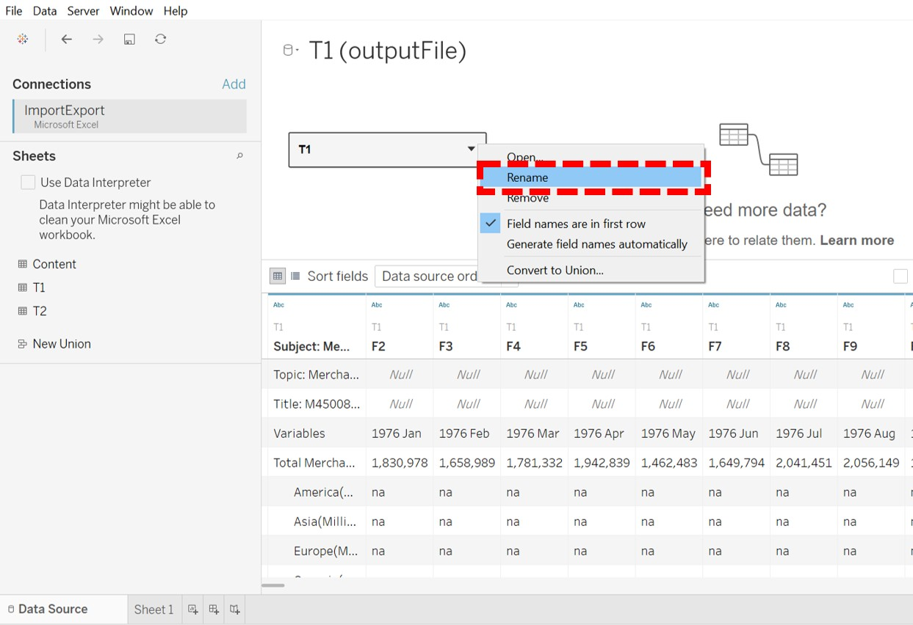

```{r setup, include=FALSE}
knitr::opts_chunk$set(echo = FALSE)
```

# Overview

Statistics on [merchandise trade data for various regions and markets](https://www.singstat.gov.sg/find-data/search-by-theme/trade-and-investment/merchandise-trade/latest-data) are compiled by Enterprise Singapore, and provided by Department of Statistics (DOS), Singapore. From this dataset, a chart depicting the import and export volumes for the top 6 trading countries for the year 2019 – 2020 was generated. We have attempted a ‘makeover’ on this chart using Tableau to improve on its clarity. This post would illustrate the makeover process and cover the following sections:

  1. The Original Visualization
  2. Critique to Identify Areas for Improvement
  3. Sketch of Proposed Design & Comments
  4. Step-by-Step Guide to Creating the Proposed Visualization in Tableau
  5. The Final Visualization
  6. 3 Major Insights Revealed by the Final Visualization Prepared
  7. References

## 1. The Original Visualization


## 2. Critique to Identify Areas for Improvement

### 2.1 Clarity

* There are no captions or commentaries. It is not clear what message is to be conveyed with the charts.
* Title does not match what is illustrated in the charts. Title says 2019 – 2020, but according to the x-axes of the charts, the periods illustrated are mostly 2019 – 2021, and only 2020 for Japan. It is not clear what the scope of the visualization is. 
* The X-axis titles are inconsistent with label markings and graphs presented. Which month and which period does “Month of Period” refer to? The variation of the line graphs show that the data presented has a higher resolution than “Year” but it is not clear what resolution it is exactly. There are also no tick marks on the axis nor gridlines in the chart area, the reader is unable to reference which data points correspond to which and what time units. 
* The Y-axes have no units. It is not clear what the unit of measurement is. It is also not clear what ‘M’ in the axis labels stand for. The scale between the primary and secondary Y-axis for is different within the chart of each country, this would mislead the reader in terms of interpretation of how the import and export volumes compare with each other. The different scales between the charts of each country would mislead the reader as well – for e.g. direct glance of the charts of Mainland China and Japan shows as if both countries have similar import/export volume, when their quantities are actually different. Comparison of import and export volumes across countries is rather painful.


### 2.2 Aesthetics

* Title is too small and does not stand out. The font size is even smaller than the individual chart titles. The alignment is off-centre as well.
* Display of country charts is not in any order of trade volume. The reader must decipher the measures on his/her own from the charts before the order can be determined. 
* The dimensions of each country chart are inconsistent and misaligned. E.g. The width of Hong Kong’s chart is narrower than that of Malaysia’s. This makes the overall outlook messy. 
* The type of chart (area chart) applied here is unsuitable as we can hardly differentiate between the chart for import and export. The area overlaps also masked the actual charts and inadvertently created a third shade of colour which made the charts even difficult to interpret. 
* The colours chosen for the area charts are unfriendly to those who are colour-blind - protanopes and deuteranopes will not be able to differentiate between the two shades.
* Abbreviation is used for United States. When it is used as a location or noun, it should be spelt out in full.


## 3. Sketch of Proposed Design


*Sketched on Microsoft OneNote for Windows 10*

## 4. Step-by-Step Guide: Creating the Proposed Visualization in Tableau

### 4.1 Data Preparation

The respective Imports and Exports data are extracted from the [DOS](https://www.singstat.gov.sg/find-data/search-by-theme/trade-and-investment/merchandise-trade/latest-data) website, as _OutputFile.xlsx_.

Exploring the data of the file in Microsoft Excel, we can see three tabs – _Content_, _T1_ and _T2_. From the description, _T1_ is for _Imports_, and _T2_ is for _Exports_ data. 

{width=35%}

We then import the data into Tableau for processing. We do this by dragging the _OutputFile.xlsx_ file into the Tableau window.


Once the data is imported, we load the individual tabs for data viewing. Here we load _T1_ (Imports) data by dragging _T1_ into the field.


For easier reference, we rename the data table to ‘Imports’. 

Right-click _T1_ > Rename


We note that there is unnecessary description information in the data table. We can get Tableau to clean this up by checking the _Data Interpreter_ box. Tableau is able to scan through and distinguish the content. This way, only the table containing the data we need remains.


In the current data structure, each _Month-Year_ is a column but we need this as a Dimension. So we do a pivot on the dataset to convert it to stacked format.

Highlight all the data columns except the _Country_ column > Right-Click on any highlighted column > Pivot


In the stacked format, rename the columns for easier reference. 


Next we repeat the above steps for _T2_ (Exports) dataset.

Drag _T2_ into the field. 


We need to tell Tableau how _T2_ (Exports) is related to _Imports_. In this case, they are related by their _Year Month_ and _Country_. As Tableau does not allow the same name for different columns, just rename the columns in the Exports dataset as _Year Month 2_ and _Country 2_ after doing the pivoting.

{width=80%}

{width=80%}
For both tables, we should check that variables are recognized in the correct format.

* _Year Month_ -> _Date_
* _Import / Export_ -> _# (Number)_
* _Country_ -> _Abc (String)_

Only _Year Month_ is not in the correct format yet. Change that to _Date_ format.


Note that the _Country_ names are illustrated together with the units _(Thousand dollars)_. These units will also appear in the visualization chart labels. We can amend this by doing a _Custom Split_ on the _Country_ column. 

Use the separator ‘(‘ , and split off the first 1 column.

{width=40%}

Now you will have the country labels on their own.

{width=70%}

According to the Task, we only need to illustrate data for the period 2019-2020 and for 6 countries : Japan, Hong Kong, Taiwan, United States, Malaysia and Mainland China. This data is filtered out using _Filters_.


Filters are created for _Country_, _Country 2_, _Year Month_ and _Year Month 2_ as shown.


The final filters list is as shown.

{width=65%}

### 4.2 Visualization Chart Preparation

Next, we proceed to add _Worksheets_ to create our visualization charts. We would need to create 3 charts before compiling all of them into one Dashboard:

* Imports Line Chart
* Exports Line Chart
* Balance of Trade Bar Chart

### 4.2.1 Creation of Imports/Exports Line Chart

The steps listed below are for the creation of the _Imports_ line chart. Similar steps are to be repeated for the _Exports_ line chart.

Create a new worksheet, rename it to _Imports_.

Drag _Year Month_ to Columns, and _Import ($’000)_ to Rows.

Click the + on _Year Month_ twice to express the data in higher resolution of _Year_ and _Month_. Note that _Quarter_ appears first but we can drag and pull it out of the field to remove it.

Drag _Country_ to the _Color Marks_ so that the line charts for the different countries will be differentiated by color.


Notice that the _Import_ (and _Export_) values are expressed in Millions and the data header says (Thousand Dollars). This means we are expected to do a conversion of the values from Millions to Billions. This is not intuitive. We shall convert the values so that it is displayed in Billions directly.

We do this by creating a _Calculated Field_.

Right-Click on the _Imports($’000)_ measure > Create > Calculated Field


Key in the formula for the calculated field, which is essentially multiplying the current value by 1000.

Replace the _Imports($’000)_ with the newly created _Imports_ measure in the Rows field


Colors assigned automatically by Tableau to each _Country_ are edited for easier visual reference.

Click the little down arrow in the Colors Legend field > Edit Colors


To avoid having green and red in the same display, manually change Taiwan’s assigned Green to purple


The months in the x-axis label are spelt out in full. This takes up unnecessary space. These can be shortened into their abbreviated forms and still be comprehensible.

Right click anywhere on the x-axis > Format > Header > Default > Dates > Abbreviation

{width=60%}

X-axis title can be removed as the _Year_ and _Month_ labels are self-explanatory

Text is formatted to be in **Bold** for them to be clearer. Text sizes are also sized accordingly to fit into the dashboard.

For easier tracking of the values for each month, vertical gridlines are also added to the line chart.

{width=40%}

Tentative output of the Imports line chart is as below.


### 4.2.2 Creation of Balance of Trade Bar Chart

The Balance of Trade is the difference between a country’s exports and imports. It is an important component in determining the current account of a country^1^. 

Balance of Trade (over a given time period) is calculated by:


<center> _Value of Exports – Value of Imports  _ </center>
  
  
A **_Trade Surplus_** occurs when there is a positive trade balance, when Exports > Imports.  
A **_Trade Deficit_** occurs when there is a negative trade balance, when Exports < Imports.

Create a new worksheet, rename it to _Bal of Trade_ for easy reference
To compute the _Balance of Trade_, we create a new _Calculated Field_.

Click on Analysis > Create Calculated Field 

Name the newly-created field _Balance of Trade ($)_.

Since Balance of Trade = Value of Exports – Value of Imports, we drag the _Export_ and _Import_ variables accordingly into the equation for computation.


Drag _Year Month_ to _Columns_, and _Balance of Trade ($)_ to _Rows_.

Since we would be grouping the charts by Countries for easier comparison, we drag _Country_ to Columns as well, and place it before _Year Month_.


Drag _Balance of Trade ($)_ to the Color Marks so that the magnitude of bar charts will be differentiated by color.

Drag the same to the _Label_ Marks so that labels can appear for each bar.


Right-click on the _Color_ bar to edit the colors assigned.

Since we want to differentiate between positive and negative trade balance, we assign one color to values > 0, another to < 0. So we set _Center: 0_. In this case, blue is positive, red is negative. 


### 4.2.3 Creation of Dashboard


## 5. The Final Visualization


## 6. 3 Major Insights Revealed by the Final Visualization


## 7. References


