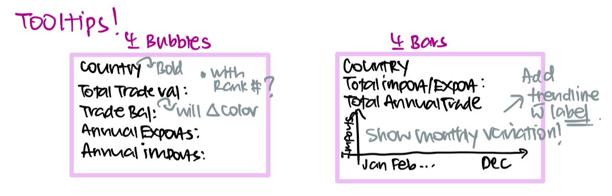
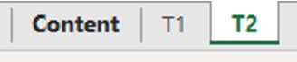
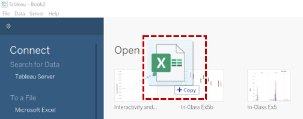
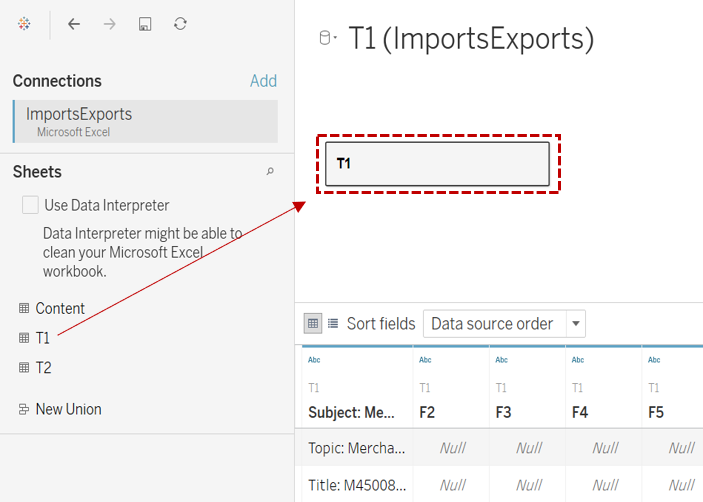
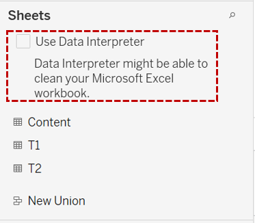
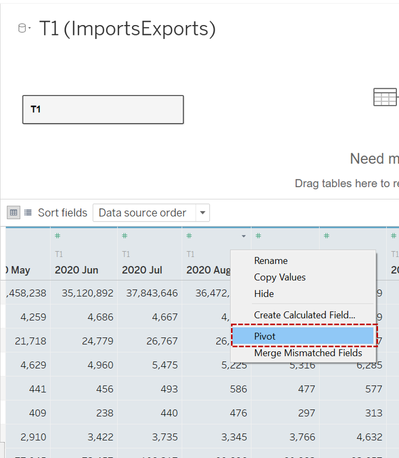
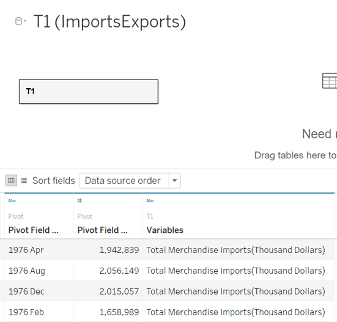
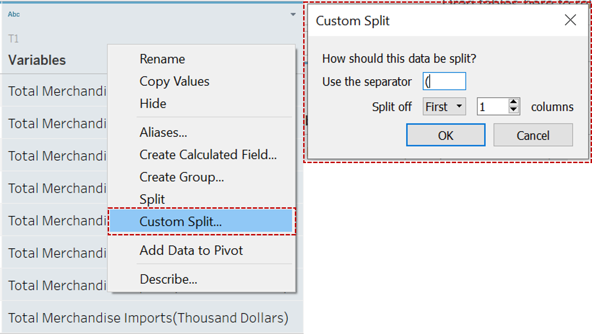

```{r setup, include=FALSE}
knitr::opts_chunk$set(echo = FALSE)
```
# Overview

Statistics on Singapore’s merchandise trade partners are compiled by Enterprise Singapore, and provided by Department of Statistics, Singapore (DOS). An interactive bubble plot illustrating the imports and exports numbers for the year 2020 for various regions is displayed in DOS’ [Singstat](https://www.singstat.gov.sg/modules/infographics/singapore-international-trade) infographics site. We have attempted a ‘makeover’ on this visualization using Tableau to improve on its clarity and interactivity as part on an assignment for an MITB module on Visual Analytics and Applications. This post would illustrate the makeover process and cover the following sections:

  1. The Original Visualization
  2. Critique to Identify Areas for Improvement
      
      + Clarity
      + Aesthetics
  3. Sketch of Proposed Design and Comments
  4. Step-by-Step Guide to Creating the Proposed Visualization in Tableau
  5. The Final Visualization
  6. Major Insights Revealed by the Final Visualization Prepared

# 1. The Original Visualization

```{r, out.width= "100%", fig.align="center", out.extra='style="float:center; padding:3px"'}
knitr::include_graphics("images/img01.jpg")
```

# 2. Critique to Identify Areas for Improvement

## 2.1 Clarity

* __Chart is restricted to 2020 figures. There are no means to compare with information from other years.__ This information that these are 2020 figures is derived from the title on the original website, which is missing from the above chart.

* __Level of detail is lacking for this interactive chart, especially in the tooltip.__ 
One of the main points covered by the bubble plot is the status of trade balance for each country/region. This is derived from the difference between the export and import value. The tooltip of each location point only shows the country/region, and a trade figure. It is also not immediately apparent whether this figure is an import value, export value, total trade value or trade balance figure. The reader must decipher this information on his/her own by reading off the axes.

* __Content illustrated in the commentary at the bottom is inconsistent with that of the chart displayed.__ The circle for United States is in the Net Exporters region, but commentary states that the value of imports exceeds exports for Singapore’s trade with the United States since 2006, implying a Net Import status. This results in information gap for the reader between the text and graphical visualization.

* __The positioning of the axis labels can be confusing. No units for axis as well.__ The Y-axis is for Imports but its label is below the X-axis ; X-axis is for Exports but its label is beside the Y-axis. Though perhaps the intention is to distinguish by color, as the color of the label and axis is similar, but the positioning of the labels is not intuitive. The units and axis marks are also missing for the axes.

* __As an interactive chart, level of interactivity seems to be restricted to just de-overlapping circle points, with no additional information derived.__

* __Method to distinguish net importers and net exporters is good, but can be unclear for some points which fall on the borderline.__ For instance, borderline cases like Japan and Republic of Korea, is it a net export or import with these countries?

## 2.2 Aesthetics

* __Use of colors make the chart beautiful, but masks the focus and message.__ While the different colors make the chart look vibrant and aesthetically pleasing, there is no focus – nothing stands out to the reader. What is the chart trying to tell us? Even the Top Net Exporter and Top Net Importer icons are camouflaged because they are of the same color tone as the rest of the chart.

* __The bubbles overlap each other, blocking information.__ The bubbles are all opaque and would block other bubbles in the same cluster. 

* __Circle labels and the corresponding bubbles are all over the place, which makes the plot look messy.__ The intention is to reflect the total merchandise trade value by the size of the bubble, but the bubbles and their mis-aligned labels (sometimes it’s on top of the bubble, sometimes it’s to the left/right) crowded the chart space, distracting the reader from being able to focus on the bubbles at first glance.

* __Difficult to read off Export and Import values for each country with no gridlines.__

* __Alignment of circle labels not optimized to make full use of space and minimize overlapping.__ For example, the label for Malaysia could be aligned to the top instead of to the right as there is so much space on top. The label for United States can also go to the right instead of to the left, then it would not be blocking the circle for Taiwan.

# 3. Sketch of Proposed Design and Comments





## 3.1 Clarity

My Proposed Design | Problems in the Original Viz Addressed
----------| -----------
The new charts would display information from 2011 to 2020, according to user’s preference. As the chart will be animated, the changes between the years the user wants to compare can also be easily visualized by toggling between the years.     | Chart is restricted to 2020 figures. There are no means to compare with information from other years.
There would be no need for the user to read off axes values in the new charts. Each bar chart will be properly labeled, and the details for each bubble are all included in the respective tooltips. The breakdown on total trade value, annual imports, annual exports, will all be in one tooltip. Even the status of the trade balance can be inferred at first glance whether it is a trade deficit or trade surplus. <br></br> There will also be additional information such as ranking by the various measures in both the bubble chart tooltips, and the bar charts. We would be able to see the top N countries for each measure immediately upon selection as well, and displayed in descending order. We can even choose how many countries to list by varying N. <br></br> If I want to drill down to monthly variations, I could too! I would only need to hover over a bar, and the corresponding monthly line chart for that measure for that year would show up. <br></br> Both charts would also linked such that if I highlight a bar, the corresponding bubble is also highlighted, and vice versa. <br></br> Thus providing flexibility as to what the user wishes to see and compare.     | Level of detail is lacking for this interactive chart, especially in the tooltip. <br></br> As an interactive chart, level of interactivity seems to be restricted to just de-overlapping circle points, with no additional information derived.
As the data for this visualization spans across the years, and the main objective is to allow the user to have flexibility to compare across different years, countries, measures etc., content coverage can be so vast. We can leave out the commentaries and attribute more space for interactivity. More white space can ease the overall view of the chart, making it look less busy overall.     | Content illustrated in the commentary at the bottom is inconsistent with that of the chart displayed.
Axes in the new charts will be excluded as far as possible as long as it is clear to the user what each axis refers to. For instance, in the bar chart, the country column is self-explanatory, we do not need a header. The Imports and Exports bars are also distinguished by color. Where headers are included, for e.g. in the bubble plot, the positions of the headers are non-ambiguous to which axis they are for. Respective units $ will also be included.     | The positioning of the axis labels can be confusing. No units for axis as well.
The original chart distinguishes between net importers and exporters by their position to the left or right of a diagonal line, which is unclear for borderline points. In our new chart, there is no need to make a judgement whether it is right or left, the distinction would be in the color – Red: Net Importer (Trade Deficit), Blue: Net Exporter (Trade Surplus). We can even see from the color intensity what the magnitude of the trade balance is – Darker colors: Very positive/Very Negative; Lighter colors: Less Positive/Less Negative.<br></br>The distinction will also be clear in the tooltip, where the value of the trade balance is indicated, and in the color of the status – Red or Blue.     | Method to distinguish net importers and net exporters is good, but can be unclear for some points which fall on the borderline.

## 3.2 Aesthetics

My Proposed Design | Problems in the Original Viz Addressed
----------| -----------
Use of colors in the new chart is only for distinction between measure types, or trade balance status. There is meaning behind the assignment of different colors. In this case, our bubbles will either be blue or red, based on their trade balance status. Our bar chart is either blue or orange, based on whether it is for Exports or Imports. <br></br>Colors are also used in our text, to serve as a legend for our visualization. For e.g. The meaning behind our red and blue bubbles are stated in the subtitle of the bubble plot (A red bubble shows a trade deficit…). For our bar chart, the color assigned to Imports and Exports are also expressed in the subtitle (Imports and Exports Statistics).<br></br>The top exporter, top importer is explicitly ranked and positioned at the top in the bar chart. No awkward floating labels required.<br></br>All other text would either be in black – for text that we want to stand out, like Chart Titles, Chart Labels, key figures in tooltips, or in grey – for subtitles, and filler text in tooltips. This is emphasis via inking.     | Use of colors make the chart beautiful, but masks the focus and message.
It is inevitable that bubbles in the plot would have to overlap each other, as they need to be large enough to be visible. We will improve the visibility by making the bubbles transparent, and with white borders so that they are distinct from each other although they overlap.<br></br>As tooltips only appear upon hover, they will not be blocked by any bubble.     | The bubbles overlap each other, blocking information.
There will be no labels in our new bubble plot, only bubbles. Labels only appear as tooltips. The outlook of the chart is cleaner this way.     | Circle labels and the corresponding bubbles are all over the place, which makes the plot look messy.
There is no need for the user to read off axes values in the new charts. All values are easily displayed in the tooltips.<br></br>The chart shows the trade positions of countries relative to each other at a high level.     | Difficult to read off Export and Import values for each country with no gridlines.
This is an area which can be improved if the labels are retained in the bubble plot as a static chart. However, as our new charts will be interactive, static labels are not included and this issue is resolved.     | Alignment of circle labels not optimized to make full use of space and minimize overlapping.


# 4. Step-by-Step Guide to Creating the Proposed Visualization in Tableau

## 4.1 Data Preparation

The data for this makeover was initially prepared by loading the excel file in Tableau Desktop. However, as the dataset was huge, this resulted in the animations being very laggy. As Tableau Desktop does not have the function to perform edits on the dataset like remove columns, we need Tableau Prep Builder to do this. Hence, the data was prepared all over again using Tableau Prep Builder, before reloading the data into Tableau Desktop for the visualization.

The steps to prepare the data in Tableau Prep Builder are documented as below, together with how to replace an existing data source in Tableau Desktop with this edited data.

The steps to prepare the file in Tableau Desktop are also included here in another tab just for reference. 

```{r panelset, echo=FALSE}
xaringanExtra::use_panelset()
```

::::: {.panelset}

::: {.panel}

## By Tableau Prep Builder {.panel-name}
The following steps show how to prepare the data via Tableau Prep Builder.

Steps | Action
----------| -----------
Exploring the data of the file in Microsoft Excel, we can see three tabs – _Content_, _T1_ and _T2_. From the description, _T1_ is for Imports, and _T2_ is for Exports data.     | {width=60%}
We then import the data into Tableau Prep Builder for processing. We do this by dragging the _ImportsExports.xlsx_ file into the Tableau window.     | {width=100%}
Once the data is imported, we load the individual tabs for data viewing. Here we load _T1_ (Imports) data by dragging _T1_ into the field.     | {width=100%}
We note that there is unnecessary description information in the data table. We can get Tableau to clean this up by checking the _Data Interpreter_ box. Tableau is able to scan through and distinguish the content. This way, only the table containing the data we need remains     | {width=50%}
Next, we are ready to proceed to next step to view and clean the data. Click _View and Clean Data_.     | {width=80%}
According to the _Task_, the study period is between January 2011 – December 2020:<br></br> Hence, we shall remove the data prior to Jan 2011 and after Dec 2020 from the data tables. This is so that the processing will not be slowed down by the huge dataset. <br></br> Since each _Year-Month_ is a column by itself currently, we shall highlight all columns prior to Jan 2011 and after Dec 2020, click the 3 dots in the function row, and _Remove Fields_     | {width=100%}
Now the data table only contains the data we need. However, it is not in the correct structure. Currently, each _Month-Year_ is a column, but we need this as a Dimension instead. So we have to do a pivot on this dataset to convert it to a stacked format.<br></br> Highlight all the data columns except the _Variables_ column, Right Click on any highlighted column > Pivot Columns to Rows     | {width=100%}
The pivoted table should look like this.     | {width=100%}
Note that the Countries in the _Variables_ column are displayed together with their units – “Million Dollars” for European Union and “Thousand Dollars” for the rest. These will also appear in any visualization that use these variables. We will extract the Country names by doing a _Custom Split_ on the _Variables_ column.<br></br>Right-Click on Variables column > Custom Split > Use Separator ‘(‘, Split off First 1 columns<br></br>A new column of the split variables _Variables – Split 1_ will appear.     | {width=100%}
We note that the units indicated in the _Variables_ column are in “Million dollars” for the major regions like European Union, America, Europe, Asia, Oceania and Africa, and “Thousand dollars” for the rest, this means that the values displayed in the _Pivot Field Value_ column need to be multiplied by a million and thousand dollars for the major region values, and other countries respectively. This is not intuitive. We shall convert the values so that the actual value is displayed. <br></br>We do this by creating a calculated field. <br></br>Right-Click on _Pivot1 Values_ column or click the three dots > Create Calculated Field > Custom Calculation      | {width=100%}
Rename the new field as _Imports (\$)_ > Key in the formula<br></br>IF [Variables - Split 1]="European Union" OR [Variables - Split 1]="America" OR [Variables - Split 1]="Europe" OR [Variables - Split 1]="Asia" OR [Variables - Split 1]="Oceania" OR [Variables - Split 1]="Africa"<br></br> THEN [Pivot1 Values]* 1000000<br></br>ELSE [Pivot1 Values]*1000<br></br>END     | {width=100%}
The format of the _Pivot1 Names_ is in String. We change it to Date format.<br></br>Right-Click the _Abc_ in the top left corner > Date     | {width=80%}
Next we will rename the data table, and the columns of the data table for ease of access. We will only rename those that we will be using eventually.<br></br>_T1_ > _Imports_<br></br>_Pivot1 Names_ > _Date_<br></br>_Variables – Split 1_ > _Country_<br></br>_Imports (\$)_ > _To be retained_     | {width=80%}
Next, we repeat the above steps for _T2_.     | {width=100%}
Finally, we have to tell Tableau how both data tables are related, so that when we apply filters later in the worksheet, the filters can apply to both tables.<br></br>We can do a _Join_ by dragging _Pivot 3_ to the area of _Pivot 1_ and drop it onto the _Union_ field which appears.     | {width=100%}
To set the _Join_ Settings:<br></br>We do a _Left Outer Join_ between _Pivot 1_ and _Pivot 3_ so that we would retain all _Date_ and _Country_ fields.      | {width=100%}
With the _Join 1_ results, we shall now do a clean up on the table to remove all unnecessary columns. We only want to retain the following:<br></br> _Date_, _Country_, _Imports(\$)_, _Exports(\$)_<br></br>Add another _Clean Step_ to clean the joined table. Remove the unwanted columns.     | {width=100%}
In addition, upon Exploratory Data Analysis, we find that import and export values aggregated by continents would be large and would throw off our country ranking later. Since these are just aggregated values and not needed in our visualization, these shall be excluded. <br></br> _America_, _Asia_, _Africa_, _Europe_, _European Union_, _Oceania_<br></br>Click on the 3 dots under _Country_ column > Filter > Selected Values     | {width=100%}
Choose the _Exclude_ tab, key in the values we want to exclude.     | {width=100%}
Create an output, then we can save this as a _.hyper_ file to import into Tableau Desktop.<br></br>I have named the _.hyper_ file as _ImportExportCombinedB.hyper_.     | {width=100%}
The cleaned data table is as shown.   | {width=100%}
Next we have to replace the Data Source used for our Tableau Desktop visualization.<br></br>Open your Tableau Desktop Workbook, navigate to any existing Worksheet. <br></br>Data > New Data Source and then connect to the new data source _ImportExportCombinedB.hyper_     | {width=100%}
Check the _Data Source_ tab that an Extract of the new data source has already been done up automatically in the canvas. If not, drag it manually.     | {width=100%}
Go back to the _Worksheet_, select Data > Replace Data Source<br></br>Current: _Your current Data Source_<br></br>Replacement: _New Data Source_<br></br>**Before you do this, make sure that the variable names currently used in the Worksheets exist in the new data source.** This way, Tableau is able to do the re-links automatically.     | {width=100%}
With this, the data source in the existing Tableau Workbook would be replaced!     | {width=100%}

Now that the data is prepared. We shall then proceed to create the visualization charts.

:::

::: {.panel}

## By Tableau Desktop {.panel-name}
The respective Imports and Exports data are extracted from [Singstat](https://www.singstat.gov.sg/find-data/search-by-theme/trade-and-investment/merchandise-trade/latest-data), as ImportsExports.xlsx.

Steps | Action
----------| -----------
Exploring the data of the file in Microsoft Excel, we can see three tabs – _Content_, _T1_ and _T2_. From the description, _T1_ is for _Imports_, and _T2_ is for _Exports_ data.     | 
We then import the data into Tableau for processing. We do this by dragging the ImportsExports.xlsx file into the Tableau window.     | {width=110%}
Once the data is imported, we load the individual tabs for data viewing. Here we load _T1_ (Imports) data by dragging _T1_ into the field.     | {width=110%}
We note that there is unnecessary description information in the data table. We can get Tableau to clean this up by checking the _Data Interpreter_ box. Tableau is able to scan through and distinguish the content. This way, only the table containing the data we need remains.     | {width=80%}
Now the data table only contains the data we need. However, it is not in the correct structure. Currently, each _Month-Year_ is a column, but we need this as a Dimension instead. So we have to do a pivot on this dataset to convert it to a stacked format.<br></br>Highlight all the data columns except the Country column, Right Click on any highlighted column > Pivot     | {width=110%}
The pivoted table should look like this.     | {width=90%}
Note that the _Countries_ in the Variables column are displayed together with their units – “Million Dollars” for European Union and “Thousand Dollars” for the rest. These will also appear in any visualization that use these variables. We will extract the _Country_ names by doing a Custom Split on the Variables column.<br></br>Right-Click on Variables column > Custom Split > Use Separator ‘(‘, Split off First 1 columns<br></br>A new column of the split Variables will appear.     | {width=100%}
We note that the units indicated in the Variables column are in “Million dollars” for European Union, and “Thousand dollars” for the rest, this means that the values displayed in the Pivot Field Value column need to be multiplied by a million and thousand dollars for European Union values, and other countries respectively. This is not intuitive. We shall convert the values so that the actual value is displayed.<br></br>We do this by creating a calculated field. <br></br>Right-Click on Pivot Field Values column > Create Calculated Field > Rename the new field as Imports (\$) > Key in the formula<br></br>IF[Country]="European Union"<br></br>THEN [Pivot Field Values]* 1000000<br></br> ELSE [Pivot Field Values]*1000<br></br>END     | {width=110%}
The format of the _Pivot Field Names_ is in String. We change it to _Date_ format.<br></br>Right-Click the _Abc_ in the top left corner > Date     | {width=80%}
Next we will rename the data table, and the columns of the data table for ease of access. We will only rename those that we will be using eventually. <br></br>T1 > Imports <br></br> Pivot Field Names > Date <br></br> Variables-Split 1 > Country <br></br> Imports(\$) > To be retained     | {width=100%}
Next, we repeat the above steps for _T2_.     | {width=100%}
Finally, the relationship between the Imports and Exports table as follows. <br></br> This would tell Tableau how the data tables are related, so that when we apply filters later in the worksheet, the filters can apply to both tables.      | {width=100%}
According to the _Task_, the study period is between January 2011 – December 2020:<br></br> Hence, we shall exclude the data prior to Jan 2011 from the data tables. This is so that the processing will not be slowed down by the huge dataset. <br></br> Filter for columns _Date_, _Date (Exports)_. <br></br> _Date_, _Date (Exports)_: Select Filter on _Range of Dates_ > Month / Year > Check the _Exclude_ box > Select all _Years_ before 2011 and after 2020. <br></br> The final filtered list is as shown.     | {width=100%} {width=80%}

:::

:::::

## {-}

## 4.2 Visualization Chart Preparation

We will need to create the following charts, in the following sequence:

  1. Imports/Exports Line Chart
  2. Imports / Exports Bar Chart
  3. Net Exports Imports Bubble Plot

The line chart will be used in the tooltips for the bar chart and the bubble plot.

### 4.2.1 Imports / Exports Line Charts

Steps | Action
----------| -----------
Create a new Worksheet, rename it to _Imports Line Chart_    | {width=80%}
We want to create a line chart to show the monthly variations of import values for each year, each country.<br></br>Imports value as the Y-axis, and _Month of Year_ as the X-axis.<br></br>So we drag _Imports (\$)_ to Rows, and _Date_ to Columns.<br></br>We then click the + symbol beside _Year (Date)_ to create a _Month (Date)_. This way, we can see the monthly variations grouped by year.     | {width=100%}
Next, we will add a filter for _Year_ to be able to show the chart for different years.<br></br>Drag the _Date_ measure to the Filters pane > Choose to Filter by _Years_      | {width=100%}
Filter > Use all     | {width=80%}
Click on the small down arrow under the _Year (Date)_ filter > Select Show Filter <br></br> On the Filter list that appears on the right window, change the list type to _Single Value (list)_. This is so that the user can select and switch single values and need not check and uncheck the entire list. <br></br>We will remove the _All_ option by Customize > Uncheck the Show “All” Value     | {width=100%}
As this line chart will eventually be referenced within the _Imports Exports Bar_ chart, we need the filter to apply to both worksheets at least. <br></br>So we will apply this setting: <br></br>Small down arrow under the _YEAR(Date)_ filter > Apply to Worksheets > Selected Worksheets <br></br>Choose the worksheets to apply to.     | {width=100%}
To enable better feel of the trend, we add a reference line for Average value. <br></br>Right-Click on Y-Axis > Add Reference Line <br></br>Choose _Average_ Value <br></br>Set to create a _Value_ label <br></br>For formatting, we will choose a light-colored line as it only serves as reference and should not be blocking any main data in the chart.     | {width=100%}
Notice that the label is very long, since it’s the actual average value in Billions. We can change the label formatting: <br></br>Right-Click on label > Format <br></br>Reference Line Label pane > Numbers > Number (custom) > Select _Billions (B)_ as Display Units     | {width=100%}
Next we perform formatting on the overall outlook of the line chart. <br></br>The header Date on the X-axis is self-explanatory, it can be hidden. <br></br>The month labels at the bottom can also be in bold font to stand out more in the tooltip later.     | {width=100%}
To let the trend variations stand out more, we exclude the zero mark from the Y-axis to provide flexibility. <br></br>Under Edit Axis > Uncheck Include zero     | {width=100%}
We now create the above line chart for _Exports_. <br></br>To do this more conveniently without having to repeat the above steps manually, duplicate the _Imports Line Chart_ worksheet. <br></br>Rename it as _Exports Line Chart_.     | {width=100%}
Drag _Exports (\$)_ to Rows, remove _Imports (\$)_ from Rows by just dragging it away from the field. <br></br>And you have the _Exports Line Chart_ created. <br></br>Note that with this method, the _Year(Date)_ filter automatically includes this worksheet as well.     | {width=100%}


### 4.2.2 Imports / Exports Bar Charts

Steps | Action
----------| -----------
Create a new Worksheet by clicking on _Sheet 1_, rename it to _Imports Exports Bar_     | {width=80%}
We want to create a pyramid bar chart with _Country_ as the Y-axis, and _Imports Value_ and _Exports Value_ as the X-axes. <br></br>So we drag _Country_ to Rows, _Imports (\$)_ and _Exports (\$)_ to Columns.     | {width=100%}
We want the bars for _Imports (\$)_ joined to the _Exports (\$)_ as one bar. So we invert the X-axis. <br></br>Right-Click on the _Imports (\$)_ axis > Edit Axis     | {width=100%}
Under Scale, check Reversed     | {width=100%}
Your bar chart should now look like this.     | {width=100%}
We can amend the colours to differentiate between the _Imports_ and _Exports_ bars. <br></br>To change the colour for the _Imports_ bar: <br></br>Go to Marks > _SUM(Imports (\$))_ Pane > Color     | {width=50%}
To add labels: <br></br>Go to Marks > SUM(Imports (\$)) Pane > Drag _Imports(\$)_ to Label <br></br>Do the same for the _SUM(Exports (\$))_.     | {width=100%}
To change the format of the labels: <br></br>Right-Click on the _SUM(Imports ($))_ Label > Format <br></br>Pane > Default > Numbers <br></br>The display units are changed to _Billions (B)_ so that the figure does not look so lengthy. This can be changed under Number (Custom). <br></br>Do the same for the _Exports_ bar chart.     | {width=100%}
Now, note that all countries are listed in the chart, sorted in alphabetical order by default. This long list is hard to read and it is also hard to compare and suss out meaningful data. <br></br>The intended design is to only display the _Top N countries_. To add on user interactivity, we shall enable the user to choose both _Top N_, and the _measure_ they want the Top N countries for, e.g. Top 10 by _Imports_, or _Exports_ etc. The output will also rank this list in descending order so that the Top country is placed at the top. <br></br> We will set this up by first creating a _Set_. <br></br>Data pane > Right-Click the _Country_ dimension > Create > Set <br></br>Rename the set as _Top N Countries by Field_.       | {width=100%}
Go to the _Top_ tab <br></br>Select _By Field_ as that is what we would be filtering the top countries by. <br></br>Key in _Top 10_ for now since we want the Top N countries. We will edit this _N_ later. <br></br>For now, we will select _By_ the sum of _Imports (\$)_ measure. We will amend this later.     | {width=100%}
To apply this to the bar chart, drag the newly created set to the Columns field. <br></br> Note to put it to the left of the _Country_ dimension because we want to filter the dimensions. <br></br> Once this is up, you will notice that the bar chart is split into two, with the top section labeled _IN_, bottom labeled _OUT_. _IN_ refers to the members included within the set of Top 10 Countries by _Imports (\$)_ as specified earlier. The rest of the members or countries are categorized under _OUT_.      | {width=100%}
Since we only want to see the _IN_ members, we can make the _OUT_ section disappear by: <br></br>Right-Click _IN/OUT(Top N Countries by Field)_ under Rows > select _Show Members in Set_     | {width=100%}
Another Header column would appear to the left of _Country_ in the bar chart. This is just a repetition of the Top 10 members in the set. We can hide this column by: <br></br> Clicking the down-arrow under the _Top N Countries by Field_ in Row > Uncheck _Show Header_     | {width=100%}
Next, we will set up a parameter required as a measure selector. <br></br> We will first do this by creating a new parameter called _Select a Measure_. <br></br> Under Data Pane > Small Down Arrow > Create Parameter       | {width=60%}
Rename the Parameter as _Select a Measure_ <br></br> Then we will manually create a list of Allowable Values. <br></br>As we want to be able to select the measures _Imports_, _Exports_ and _Total Trade Value_, we key these options in accordingly.     | {width=100%}
We want to tell Tableau what output we would like when we choose the above values, so we need to create a _Calculated Field_. <br></br> Select Analysis > Create Calculated Field <br></br> Rename the calculated field as _Selected Measure_. <br></br> Then key in the formula as shown. We are basically telling Tableau when _Imports_ is selected, please output the measure _Imports (\$)_ etc. <br></br> Make sure that the calculation is valid.     | {width=100%}
Next, we will create another parameter for selecting N, where the Top N countries will be displayed in the bar chart. <br></br> Create a new parameter and rename it to _Select Top N_. <br></br> Select _Integer_ as the Data type as we want the selected output to be whole numbers. <br></br> For allowable values, we can select _All_ or choose to have a _Range_. I chose to set Minimum as 10 for aesthetic reasons, so that there would be at least 10 bars on the dashboard at all times, and Maximum of 120 as there are 114 countries/regions in our dataset to list.     | {width=100%}
With these newly created measures, we can proceed to apply them to the chart. We do this by editing the settings of the _Top N Countries_ set. <br></br> Go to the _Top N Countries_ Measure under Rows > Small Down Arrow > Select Edit Set     | {width=50%}
Remember that we set to generate the Top 10 Countries by the _Imports (\$)_ measure earlier? We shall now change that to an _dynamic open field_ which allows us to vary the measure. <br></br> Change _Imports (\$)_ selection to _Selected Measure_. <br></br> Click Apply.    | {width=100%}
To enable the user to choose the _Selected Measure_, we enable the parameter control. <br></br> Under Parameters > Small Down Arrow of Select a Measure > Show Parameter     | {width=100%}
The Parameter Control will now appear to the right of the screen. <br></br> Click the Small Down Arrow to switch to _Single Value (List)_ to show the list as radio buttons and allow easier selection.     | {width=100%}
Notice now that the list is sorted in alphabetical order. It would be neater if we could show the Top 10 Countries for each measure in _descending order_. This would enable the user to know which country is the Top Importer/Exporter at one glance instead of needing to do the sorting manually. <br></br> We change this setting by: <br></br> Small Down Arrow of _Top N Countries_ measure under Rows > Select Sort     | {width=50%}
Sort By _Field_ <br></br> Sort in _Descending_ Order since we want the Top Importer/Exporter to be positioned on top <br></br> Field Name: _Selected Measure_. <br></br> This means we want to sort according to the measure selected by the user. <br></br> Close the window after selection.   | {width=100%}
Now the bar chart displays the Top _10_ Countries according to the selected measure, in _descending_ order.     | {width=100%}
Link the Parameter to the _Set_ by applying _Select Top N under By Field_. <br></br> Show Parameter for user control. <br></br> We will choose _Slider_ as the type for user control as it is more convenient for user to change the _N_ figure with the mouse.      | {width=100%}
Next, we will add a filter for _Year_ to be able to show the chart for different years. <br></br> Drag the _Date_ measure to the _Filters_ pane > Choose to Filter by _Years_    | {width=100%}
Filter > Use all    | {width=60%}
Click on the small down arrow under the _Year (Date)_ filter > Select _Show Filter_ <br></br> On the Filter list that appears on the right window, change the list type to _Single Value (list)_. This is so that the user can select via a radio button and switch single values and need not check and uncheck the entire list. <br></br> We will remove the All option by Customize > Uncheck the _Show “All”_ Value     | {width=100%}
We can also edit the filter title to make it more friendly, like _Select Year_. We will also edit the filter title for _Select a Measure_. <br></br> Right-Click on _YEAR(Date)_ filter > Edit Title <br></br> New title for _YEAR (Date)_ : _Select Year_ <br></br> New title for _Select a Measure_ : _Rank By:_     | {width=100%}
We want to let the chart title reflect the output accordingly. For e.g. if the chart is ranked by Imports, for the Year _2012_, we want to show that in the title. <br></br> Hence, we will amend the title text this way. By replacing the text with the field variable itself, it would vary with the selected field. <br></br> The subtitle will also double up as the legend for the chart. This way we can exclude the headers at the bottom of the chart. They are also not needed since we have labels for each bar.    | {width=100%}
Next, we do up the tooltips. The tooltips are designed such that when the user hovers across say the _Imports bar_, the country, the value, the line chart showing the monthly variation of the measure for that year, and the total trade value should pop up. <br></br> We start by doing this for the _Imports bars_.  <br></br>Select _SUM(Imports (\$)_ under Marks pane > Tooltip    | {width=50%}
Within the tooltip, we insert the _Imports Line Chart_ by going to Insert > Sheets > _Imports Line Chart_ <br></br> The formatting line would then appear in the box. We shall adjust the figure width to a dimension fits properly, here I have chosen 600. Then we want to include a filter for the chart by _Country_ and _Year_. So we key in < Country > and < YEAR(Date) > under _filter =_.     | {width=120%}
You would notice that the _Total Trade_ is absent in the dropdown list under _Insert_ within the tooltip. This is why we need an additional step. <br></br> To insert _Total Trade Value_ into the tooltip, we first drag the _Total Trade_ measure into the Tooltip Marks field. This is so that it can be included in tooltips. <br></br> With this, we can simply insert this measure like how we insert the chart in the previous step.     | {width=120%}
Formatting can be done directly within the tooltip window to beautify the display. <br></br> You can also do a _Preview_ to view the outcome of the settings before applying them.     | {width=120%}
Repeat the above two steps for _Exports_ bars, but selecting to insert _Exports Line Chart_ within the tooltip. <br></br> This is what the final tooltips would look like.     | {width=120%}
To be able to see how the trends and ranks vary with each user selection, we can apply _Animation_. <br></br> Format > Animation <br></br> Switch it to _On_ for _Workbook Default_ so that it can apply to all Worksheets. <br></br> For duration, can set it to slow so that movements can be more obvious and visible. We can leave the style as simultaneous if we want every change to move together.      | {width=120%}
The final _Imports Exports_ bar chart.     | {width=130%}


### 4.2.3 Net Exports Imports Bubble Plot

Steps | Action
----------| -----------
Create a new Worksheet by clicking on _New Worksheet_, rename it to _Net Bubble Plot_     | {width=70%}
We want to create a scatter plot with _Imports_ as the Y-axis, and _Exports_ as the X-axis. <br></br> So we drag Imports (\$) to Rows, and Exports (\$) to Columns. <br></br>Note that only one point appears in the plot. This is because Tableau has aggregated all values.     | {width=100%}
We shall now tell Tableau that we want the points categorized by _Country/Region_.<br></br> We do this by dragging _Country_ to Detail under Marks to disperse the points into their respective regions. <br></br> Now you will see the scatter points for each country on the plot.     | {width=100%}
Next, we want to reflect the total merchandise trade value (i.e. sum of imports and exports) of each country by the size of the bubbles. <br></br> We do this by_ Creating a Calculated Field_. <br></br> Right-Click the _Imports(\$)_ measure > Create > Calculated Field     | {width=100%}
We will name this new calculated field _Total Trade_. <br></br> Key in the formula: <br></br> [Imports (\$)] + [Exports (\$)]<br></br> If the variables and links have been inserted correctly, Tableau will tell you that the calculation is valid.     | {width=100%}
With this new measure created, we can then size our bubbles with it. <br></br> Drag _Total Trade_ to Size under Marks. <br></br> If the bubbles look too small, their relative sizes can be adjusted by clicking on Size and varying the meter. Take note not to increase the sizes too much such that the circles overlap and block information.     | {width=100%}
To make the bubbles stand out more, we fill them. <br></br> Go to Marks > Change _Automatic_ to _Circle_. <br></br> We now see that the bubbles are filled but seem coalesced. This can be solved by changing the format under Marks > Color. <br></br> Set border to _White_ and Opacity to _79%_ so that the bubbles are more distinctive from one another. Note that with this colour combination, there seems to be a 3D effect to the bubbles as well, which looks good.      | {width=120%}
Next, we want to reflect the status of trade balance for each market. The status will give an indication of whether the there was a net export or import with these partners. <br></br> Trade balance is computed by : _Value of Exports_ – _Value of Imports_<br></br> **Trade Surplus** occurs when there is a positive trade balance, when Exports > Imports. <br></br> **Trade Deficit** occurs when there is a negative trade balance, when Exports < Imports. <br></br> We will create a calculated field to compute the _Trade Balance_. <br></br> Analysis > Create Calculated Field > Rename the field to _Trade Balance_ <br></br> Drag the _Exports (\$)_ and _Imports (\$)_ variables to the formula field accordingly: Exports – Imports. <br></br> Check that the calculation is valid before applying.     | {width=120%}
We want to differentiate the trade balance status by bubble color. This means that we can tell from the color whether this market has a trade surplus or trade deficit. The color intensity should also tell us the extent of the surplus or deficit. <br></br> Drag the newly created field _Trade Balance_ to Color (under Marks).    | {width=80%}
We will now adjust the color settings such that a trade surplus will show blue, trade deficit will show red. The distinction is between positive and negative values, therefore we choose two diverging colors. <br></br> The color settings can be done by clicking on Color > Edit Colors <br></br> Choose the colors on both ends of the spectrum. In this case, it would be blue on the side with the greater value, and red on the other. Be sure to set the _Center_ to 0 under Advanced settings. This will ensure that 0 is the distinction point between blue and red, where blue is positive, red is negative. <br></br> Note that there is a gradual intensity applied, so as to reflect the magnitude of the value. Darker color would mean a greater magnitude, be it positive or negative.    | {width=100%}
Next, we want to set up the tooltips for the bubbles, to let the user have access to more information when they hover over a bubble. <br></br> Per our design, we would need to include the following figures: <br></br> **Trade balance** figure (with deficit/surplus status reflected in color) <br></br> Country’s **rank** in terms of _Total Trade Value_ <br></br> **Annual Imports** and **Annual Exports** <br></br> We would first set up the trade balance input. Note that we already have this measure in place, so the following steps are taken just to differentiate the status by color. We shall create two calculated fields – one for _Trade Surplus_, the other for _Trade Deficit_.<br></br> Go to Analysis > Create Calculated Field <br></br> The respective formulas to key in for the calculated field are as shown. Note that the output of both formulas have to be mutually exclusive and continuous (i.e. if one is > 0, the other has to be <=0) <br></br> Drag both new calculated fields into the Tooltip Marks pane.     | {width=100%}
Then we set up the ranks for each measure. We will use the _RANK_DENSE()_ formula for this. As the highest value is ranked top, we will key in _desc_ as an argument. <br></br> Go to Analysis > Create Calculated Field <br></br> Rename the computed field, key in the formula as shown. Note that a _Default Table Calculation_ will appear above the OK icon after the formula is keyed in. We need to adjust this to tell Tableau what field to do the ranking by. So click on _Default Table Calculation_ > Switch _Automatic_ to _Country_.     | {width=100%}
Key in the formulas for _Exports_ and _Total Trade Value_ respectively to create their _Ranking_ measure.     | {width=100%}
Next, we will add a filter for _Year_ to be able to show the chart for different years. <br></br> Drag the _Date_ measure to the Filters pane > Choose to Filter by _Years_    | {width=100%}
Filter > Use all     | {width=60%}
Click on the small down arrow under the _Year (Date)_ filter > Select _Show Filter_ <br></br> On the Filter list that appears on the right window, change the list type to _Single Value (list)_. This is so that the user can select via a radio button and switch single values and need not check and uncheck the entire list. <br></br> We will remove the _All_ option by Customize > Uncheck the _Show “All” Value_     | {width=100%}
Next we link this filter with the general _Select Year_ filter we have created earlier for all Worksheets. This way, the user just has to select once and it will be applied to all. <br></br> Small down arrow under the _YEAR(Date)_ filter > Apply to Worksheets > Selected Worksheets <br></br> Check _Net Bubble Plot_ as well.    | {width=100%}
We will now proceed to set up the bubble tooltips. <br></br> Drag the following measures into the Tooltip Marks pane so that they can be used within the Tooltip. <br></br> _TradeDeficit_, _TradeSurplus_ , _Ranking by Exports_, _Ranking by Imports_, _Ranking by Total Trade_     | {width=100%}
Insert the measures within the Tooltip field as shown. <br></br> For the Trade Balance Status, even if we include both _TradeDeficit_ and _TradeSurplus_, only the valid one would appear in the tooltip. <br></br> Formatting can be done within this window as well.      | {width=100%}
Note that the value figures are displayed in actual numerals, we would like it to be succinct and consistent with the rest of the visualization, so we amend it to show in _$ B_, to 2 decimal places. <br></br> We can change this under the Format > Pane > Default > Numbers > Number (Custom) setting for all respective measures. <br></br> Insert \$ as the Prefix, and _Billions (B)_ as Display Units.     | {width=100%}
The final tooltip would look like this.     | {width=100%}
Amend the title to reflect what the chart is telling us. <br></br> We also include the _Year_, which should change dynamically according to the user selection. This is to tell the user clearly for which year the chart is showing values for. <br></br> The subtitle would give the user some guidance on how interactive the chart can be. <br></br> Double click the title to call up the _Edit Title_ window.     | {width=100%}
The final bubble plot looks like this, with one of the tooltips displayed.     | {width=100%}

## 4.3 Dashboard Preparation

We already have all the charts required for the dashboard. We shall set that up next.

Steps | Action
----------| -----------
Create a new Dashboard Tab, rename it to _Trade DB_     | {width=60%}
Change the Layout Size from the default _Desktop_ to _Automatic_. This is so that it is flexible enough to resize itself and be viewed on any screen type.     | {width=60%}
The planned layout will be as follows. <br></br> We shall drag the sheets to the respective areas. <br></br> Use _Blank_ objects to adjust space between the filters to prevent them from cluttering together.     | {width=100%}
The year selection is synchronized between the bubble plot and bar chart. That is good and we would retain that. <br></br> It would be good also if we allowed the user to select a bubble in the bubble plot, and the corresponding bar chart for that country is highlighted, and vice versa. <br></br> We will do this setting by: <br></br> Dashboard > Actions > Add Action > Highlight     | {width=100%}
Rename the Action to _HighlightBoth_. <br></br> Tableau has selected to run action on _Select_, and for both displayed sheets by default. As that is what we need, we retain these settings.     | {width=70%}
And our final dashboard is ready!     | {width=120%}

# 5. The Final Visualization

The visualization can be accessed  [here](https://public.tableau.com/app/profile/mt.tong/viz/DataVizMakeover2_16240837165630/TradeDB).


There can be various levels of interaction for this dashboard. Every change is animated so that the user is able to see the transition. 

One, we can select the year we want to see the numbers for under the filter _Select Year_.

We also can hover over a bubble to see more information on that country/region. 


We can hover over each bar chart to see the monthly variation trend of the export value for that country.


We can also choose the measure we want to see the Top 10 ranked countries for – by _Imports_, _Exports_, or _Total Trade Value_. The countries will be listed and arranged accordingly in descending order. The following bar chart is ranked by _Exports_ value.


If we want to see the _Top 20_ list instead of _Top 10_, we can easily change this with the _Select Top N_ slider on the right. The following view shows the _Top 13_ list, where _N_ = 13.


Lastly, when one bubble or bar chart of one country is selected, the corresponding bar chart or bubble in the other chart would be highlighted.


# 6. Major Insights Revealed by the Final Visualization Prepared

1. From 2011 to 2019, Mainland China, United States, and Malaysia secured the top 3 positions as Singapore’s top importers. Initially in 2011 and 2012, Malaysia was the top importer. Mainland China’s imports grew in the next 2 years to secure the top position ever since, and also leading by a huge margin of about $10 Billion compared to the second highest importer. Malaysia and United States have been taking turns with the second and third position for the subsequent 7 years, until 2020, when Taiwan overtook United States to take the third position.

2. For exports, Singapore’s top exporters were Malaysia, Indonesia and Hong Kong in 2011. Mainland China ousted out Indonesia and squeezed into the Top 3 in 2013, and secured the top spot ever since. Malaysia dropped to the 4th position in 2020 when it was overtaken by United States. From the monthly variation line charts, we could see that there were huge changes for both countries. Malaysia’s exports were on a downslide from Jan and hit the bottom in April when the first Movement Control Order (MCO) was issued due to the Covid-19 pandemic. While there was some pull back after April, it still hovered at low levels. On the other hand, we saw big fluctuations in export levels with the United States, likely due to the trade duel with China. United States’ spikes and climbs in export levels were significant enough to overtake Malaysia’s.  
 
3. By total trade value, Singapore’s Top 5 partners are Mainland China, Malaysia, Indonesia, Hong Kong and United States, with total trade value of up to \$430 Bil annually. These 5 partners have secured their top positions throughout 2011 to 2020. From 2011 to 2018, apart from United States, all the other 4 partners were in a trade surplus status, or they are net exporters for Singapore. In 2019, Malaysia went into a slight trade deficit of -\$0.73 Bil (exports < imports) and the deficit situation worsened to -\$11.65 Bil in 2020 due to Covid-19. United States, on the other hand, switched from a trade deficit status of -\$14.4 Bil in 2019, to a trade surplus of $5.67 Bil in 2020. 

4. Hong Kong is a consistent high net exporter for Singapore for all years from 2011 to 2020. By virtue of its strategic geographical location, and infrastructure, it has secured its position as a trans-shipment hub. It has 99% of shipments coming from re-exports.

5. It is observed that net export volume for all of Singapore’s Top 5 partners, except Hong Kong, has reduced from 2011 to 2020. It might seem as though there are less exports for them. However, note that this is the net export volume and not the absolute export volume. So, when we look at the actual total trade, import and export values, we can see that total trade value has increased. It is because the value imported is now nearer to value exported, hence the net export status has shrunk.

