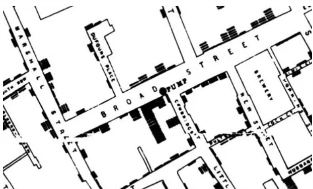
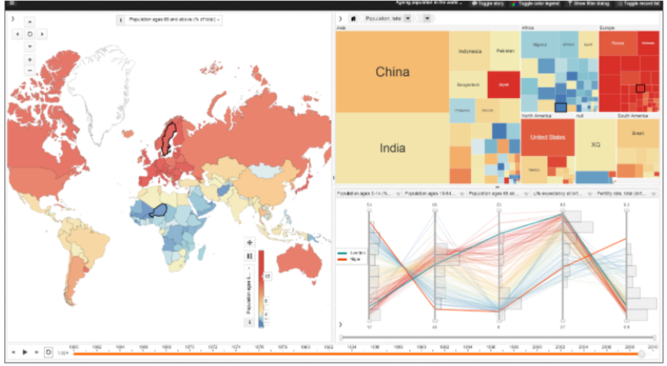
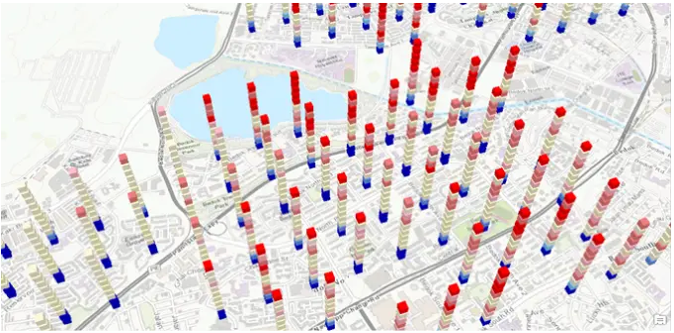
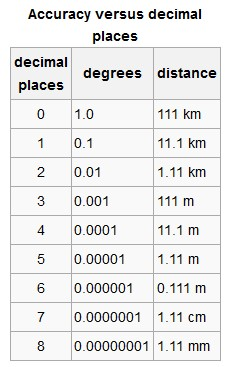

```{r setup, include=FALSE}
knitr::opts_chunk$set(echo = TRUE, message = FALSE)
```

```{r Installing Loading Reqd Libraries, include=FALSE}

packages = c('DT','tidyverse', 'ggiraph', 'plotly', 'lubridate', 'naniar','stringr','dplyr','ggstance','ggpubr','hms','data.table','raster','sf','tmap','clock','rgdal','tibbletime','networkD3', 'mapview','scales','knitr')

for(p in packages){
  if(!require(p, character.only = T)){
    install.packages(p)
  }
  library(p, character.only = T)
}

```


# Background

Since 20 years ago, GASTech has been operating a natural gas production site in the island country of Kronos. The business has been profitable, and the company has also developed close relationships with the Kronos Government. In January 2014, following GASTech's initial public offering listing, several GASTech employees has gone missing. An organization known as Protectors of Kronos (POK) is suspected in these cases of missing persons, as GASTech's business moves had not been too environmentally friendly. A thorough investigation is to be carried out by the law enforcers of Kronos and Tethys to break this case.

Information and data pertaining to the whereabouts of company cars, purchases made by employees in local stores have been provided to the law enforcers. We shall use visual analytics to sense-make this data to facilitate the investigation. 

This would be done as a sub-component which would eventually feed into an interactive Shiny app for the use of the law enforcers, together with other sub-components covered by my project group mates. The objective of this assignment is to explore what the insights are and how they can be brought out from the depths of this dataset to aid in the investigation.  

# Literature Review

## Crime Analysis - Overall

Crime analysis is a law enforcement function which involves systematic analysis for identifying and analyzing patterns and trends in crime and disorder [**Wikipedia**]. Too little data would inevitably limit the efficiency of the investigation, but overwhelming volume of information could pose a huge challenge as well. Coupled with the need for rapid analysis, too much information to absorb, categorize, remember and draw meaning from could compromise the overall investigation [**Crime-Analysis ScienceDirect**]. Visual analytics techniques could be employed to gain useful insight from massive raw data.

For efficiency in data processing, information must first be consistent as subtle differences can greatly increase variability and reduce the reliability and value of a dataset [**Crime-Analysis ScienceDirect**]. Next, there cannot be information overload within a diagram. Good practices such as appropriate brushing and linking, selecting and marking, aggregation, elimination, virtual navigation techniques such as zooming, focus + context, and details-on-demand techniques have been studied and used to overcome an over-cluttered screen.[**Ku et. al, 2016**]. Uninteresting and expected patterns can also be unmarked to improve efficiency and reduce false positives. [**Arxiv**]

## Approaches to Analyze Anomalous User Behaviors

According to [**Arxiv, Visual of Anomalous User Behavior**], detection of anomalous user behaviors can be a challenging task as the boundary between abnormal and normal data may not be clearly defined, and approaches like machine learning lack contextual information to support decision-making. Visualization techniques like sequence visualization, graph visualization, text visualization, geographic visualization, chart visualization can be combined with interaction methods like tracking and monitoring, pattern discovery, exploration and navigation to analyze anomalous user behaviors.

Analysis of anomalous travel behaviors can take the following approaches:

* Difference from expected patterns indicated by historic records
* Detection of irregular driving direction, hotspots
* Characteristic travel patterns associated with groups of travelers
* Statistical methods to identify outliers such as use of boxplots to look at deviation and its extent

Analysis of anomalous transactions can take the following approaches:

* To be used in conjunction with spatiotemporal data
* Probe into time series along with details on amounts transacted, no. of transactions within a period
* Identify activities that are new to the user

## Visualizing Movement / Geospatial Map Types

According to Robert Krueger [**Year**], movement data is more complex to handle than simple point-based data as it contains complex hierarchical structures of overlapping trajectories with diverse shapes and directions. 

1. Graphs (**R. Krueger**)

Movements can be spatially aggregated. A full spatial and temporal aggregation of the trajectories can result in a static graph G = (V,E) consisting of nodes V and edges E. Each edge e = (u,v) can encode directions and contain a weight that holds the travel volumes between the nodes. Analysis is flexible with this graph network and techniques such as clustering, segmentation, aggregation can be performed.  

2. Thematic Maps



This is the world famous cholera map produced by [Doctor John Snow](https://www.theguardian.com/news/datablog/2013/mar/15/john-snow-cholera-map) in 1854. Each bar plotted onto the map represents a death case. It was then immediately apparent where the deaths clustered, enabling investigation to be directed and focused. It eventually led them to the culprit water pump in Broad street which was polluted by sewage water tainted by a disposed baby nappy with cholera. Death statistics on their own might not have led to this discovery this soon had it not been geo-localized. This spatial autocorrelation is powerful.

3. Spatial-Temporal Perspectives: Multiple Coordinated Views (MCV)

Visualizations can include many types such as thematic maps, scatter plots, parallel coordinate plots, timelines and a wide range of other techniques. Interactivity to allow quick switching between these views can facilitate more insights. These systems are described generally as [coordinated-view visualizations](https://gistbok.ucgis.org/bok-topics/geovisual-analytics). An example is shown as below. Global population trends by country are compared using a parallel coordinate plot, choropleth map and treemap. (Image courtesy of the National Center for Visual Analytics at Linkoping University)



4. Spatial-Temporal Perspectives: 3D Coordinate System (Space-Time Cubes)

There can be perspective distortion and occlusion, but the spatio-temporal distribution can be highlighted. [**R. Krueger**]. [Space-time cubes](https://gisgeography.com/space-time-cubes/) show change over time within geographic space. Each cube represents a slice of time, in which the topmost cube has the newest timestamp. Temporal changes in that geographic area can then be visualized. Map below shows a space-time cube web scene in [ArcGIS Online (AGOL)](https://gisgeography.com/space-time-cubes/).



## R Packages to Be Applied

1. DT - To make data tables interactive
2. plotly - For interactive charts
3. mapview, tmap, sf, raster - to handle geospatial data and movement visualization
4. lubridate, clock - to handle time and date values
5. scales - To handle label formatting in charts


crosstalk - To create links between objects for interactivity
raster - to handle geospatial data
sf - to handle geospatial data
tmap - for map visualization
clock - to take care of time value (newer r package compared to lubridate)
lubridate - 
mapview - to visualize maps

raster, tmap, sf, clock (for movement visualization)

for geospatial data
tmap for map visualization
raster and sf for handling geospatial data
can use clock package to suss out the day of week/day of year for our MC2 question.

# Data Available

The following information is available.

1. Employee that the company car is assigned to : Last Name, First Name, CarID, Current Employment Type, Current Employment Title [_car-assignments.csv_]
2. GPS Tracking Info of Company Cars : Date, Time, Car ID, Latitude, Longitude [_gps.csv_]
3. Credit Card Transactions: Location, Date, Time, Price, Credit Card No. [_cc_data.csv_]
4. Loyalty Card: Location, Date, Price, Loyalty Card No. [_loyalty_data.csv_]


# Data Wrangling and Preparation

The type of data required would vary with the questions. This section would only cover the main data set up, EDA, quality of data, any general manipulations such as correcting the format of the data.

Special data manipulation specific to the questions would be covered in their respective sections instead.

We first load the datasets, via the read_csv() function.

```{r Loading the Datasets, echo=TRUE}

car_assigned <- read_csv("data/car-assignments.csv")
gpstracking <- read_csv("data/gps.csv")
loyaltycard <- read_csv("data/loyalty_data.csv")
creditcard <- read_csv("data/cc_data.csv")
emprecords <- read_csv("data/EmployeeRecords.csv")

```

To check for missing values, we use the _naniar_ package. The [naniar](https://naniar.njtierney.com/) package provides tidy ways to summarize, visualize and manipulate missing data.

```{r check missing values, echo=TRUE}

#For car_assigned
miss_var_summary(car_assigned)
#For creditcard
miss_var_summary(creditcard)
#For gpstracking
miss_var_summary(gpstracking)
#For loyaltycard
miss_var_summary(loyaltycard)

```

Here, we observe that the only dataset with missing values is _car_assigned_. From the filter below, we see that the truck drivers are not assigned cars. For now, other than to acknowledge this fact, we are indifferent to the missing values as there seems to be no other dataset which contains _LastName_ and _FirstName_ to be able to use the information below. Later, we would see that there is location tracking information on vehicles not within the cars list. These vehicles can be associated with any of the truck drivers below. 

For now, these rows can also be removed since we will be doing a join with the other datasets and would require a uniquely valid column without missing values. They will be removed via the _complete.cases()_ function.

```{r car_assigned missing values, echo=TRUE}

car_assigned %>% 
  filter(is.na(CarID))

car_assigned_only <- car_assigned[complete.cases(car_assigned),]

```
Next, we shall ensure that the Timestamps are in the right and consistent format, using the _lubridate_ package. For the _loyaltycard_ dataset, the timestamp is only in _mdy_ format. We will observe that the timestamp will be converted to POSIXct (for creditcard and gpstracking dataset), and Date (for loyaltycard as there is only date data).


```{r formatting timestamp, echo=TRUE}

#For creditcard dataset
creditcard$TimeStampFormatted <-mdy_hm(creditcard$timestamp)

#Delete timestamp column
creditcard <- creditcard %>% 
  dplyr::select(-timestamp)

#Reorder columns
col_order <- c("TimeStampFormatted", "location","price","last4ccnum")
creditcard <- creditcard[, col_order]

#For gpstracking dataset
gpstracking$TimeStampFormatted <-mdy_hms(gpstracking$Timestamp)

#Delete timestamp column
gpstracking <- gpstracking %>% 
  dplyr::select(-Timestamp)

#Reorder columns
col_order <- c("TimeStampFormatted", "id","lat","long")
gpstracking <- gpstracking[, col_order]

#For loyaltycard dataset
loyaltycard$TimeStampFormatted <- mdy(loyaltycard$timestamp)

#Delete timestamp column
loyaltycard <- loyaltycard %>% 
  dplyr::select(-timestamp)

#Reorder columns
col_order <- c("TimeStampFormatted", "location","price","loyaltynum")
loyaltycard <- loyaltycard[, col_order]

```

We also observe special unidentifiable characters in _Katerina's Cafe_ in the _creditcard_ and _loyaltycard_ dataset. Those shall be identified and replaced using the str_replace_all() function to prevent error in data processing.

```{r special char in katerinas cafe, echo=TRUE}

#creditcard

creditcard <- creditcard %>% 
  mutate(location = str_replace_all(location,pattern = "Katerin.+",replacement = "Katerinas Cafe"))%>%   mutate(location = str_replace_all(location,pattern = "[^[:alnum:]]",replacement = " "))

#loyaltycard

loyaltycard <- loyaltycard %>% 
  mutate(location = str_replace_all(location,pattern = "Katerin.+",replacement = "Katerinas Cafe"))%>%   mutate(location = str_replace_all(location,pattern = "[^[:alnum:]]",replacement = " "))


```

Next, we include into the _gpstracking_ dataset, the first and last names of the personnel the car is assigned to. We essentially want to do a left join for the _gpstracking_ dataset, and the _car_assigned_ dataset, by the car ID. We can do this with the left_join() function. 

```{r Joining gpstracking and car_assigned}

gpsname <- left_join(gpstracking, car_assigned_only, by = c("id" = "CarID"))

#Join First Name and Last Name

gpsname$name <- paste(gpsname$FirstName, gpsname$LastName)

#Reorder cols
col_order <- c("TimeStampFormatted", "id","lat","long","name","LastName","FirstName","CurrentEmploymentType","CurrentEmploymentTitle")
gpsname <- gpsname[, col_order]

```

Next, we shall prepare the geospatial map for viewing. We would use the _Raster_ package to import the raster file for the map of Abila.

The file to be imported is already georeferenced using qGIS, into .tif format.
Note that the raster layer is a three bands false colour image, we would use tm_rgb() instead of tm_raster() to be able to display all three bands. If not, the layer would come out in monochrome.

```{r Geomap}

#Importing the Raster file

bgmap <- raster("data/MC2/MC2-tourist_modified.tif")

#Plotting the Raster Layer and defining as base layer.

tmap_mode("view")

tmain <- tm_shape(bgmap) +
  tm_rgb(bgmap, r = 1, g = 2, b = 3,
            alpha = NA,
         saturation = 1,
         interpolate = TRUE,
         max.value = 255)

```

**KIV CAN DELETE THIS IF NOT USED EVENTUALLY**
Next we input the vectors, which comes in the form of ESRI shapefile format. We shall import this shapefile using _st_read()_ of the sf package. This shapefile is already coded in WGS 84 format.

```{r importing vector GIS data file CAN DELETE IF DONT NEED}

Abila_st <- st_read(dsn = "data/MC2/Geospatial",
                    layer = "Abila")

```
Then, we shall map the aspatial data next. Essentially, the following general steps are required to be able to create layers to visualize on the map:

1. Select the latitude and longitude coordinates that we want displayed. These coordinates are in the _.dbl_ format.

2. Convert it to Simple Feature Data Frame via the _st_as_sf()_ function of the _sf_ package; Coordinates would be converted to geometry format. They would be input as longitude ('long' ; x-coordinates) and latitude ('lat' ; y-coordinates), in the EPSG: 4326 format, which is the wgs84 Geographic Coordinate System.

Example:

```{r Conversion into Simple Feature Data Frame, echo=TRUE}

gps_sf <- st_as_sf(gpstracking,
                   coords = c("long", "lat"),
                   crs = 4326)
```

3. We can either use them as individual geometry points, or string them up to form a path

4. To form a path, we use the _st_cast("LINESTRING")_ function

Example:

(Here, we are creating the movement path from GPS points for each car. Hence, we need to group the data by the car ID, the identifier. As R requires a command following the group_by() function, an input will be required for the code to run, so we include a dummy summarize() code to overcome this issue.)

```{r Creating Movement Path, echo=TRUE}

gps_path <- gps_sf %>% 
  group_by(id) %>% 
  summarize(m = mean(TimeStampFormatted),
            do_union = FALSE) %>% 
  st_cast("LINESTRING")

```

We would like to find out where the vehicles have gone to.
First, we have to identify the coordinate points where the vehicles have possibly made stops, and be able to visualize where these stops are on the map. We could decipher this information from the _gpstracking_ data, which tracks the coordinate points of vehicles as long as they are moving. This means that when there is a long gap in the timestamp at a particular coordinate point, it is likely that the vehicle has parked. Stops at traffic light junctions should take no longer than 2 minutes. As such, we shall assume for vehicles which are stationary for more than 4 minutes to be parked (i.e. search for timestamps with lag of more than 4 minutes). 

In addition, we note that for position coordinates, the number of decimal places required for a particular accuracy at the equator is:


Considering the sizes of typical carparks, the accuracy of 1.11m would be too precise. A more likely range could be 11.1m. With this, we shall round all our coordinate points up to 4 decimal points for analysis.

A map with all stops identified from the entire _gpstracking_ dataset is as shown.


```{r interactive map viewing of the points}

#Round lat long points to 4 decimal points

gpstracking$lat <- round(gpstracking$lat, 4)
gpstracking$long <- round(gpstracking$long, 4)

#Identifying all stops for all Car IDs and Time

all_stops <- gpstracking %>%
  group_by(id) %>%
  mutate(stop = TimeStampFormatted - lag(TimeStampFormatted)) %>%
  mutate(parked = ifelse(stop >60*4, TRUE,FALSE)) %>%
  ungroup() %>%
  filter(parked == TRUE) %>%
  distinct(lat, long)

#Converting it to sf

all_stops_sf <- st_as_sf(all_stops,
                         coords = c("long", "lat"),
                         crs = 4326) %>% 
  mutate(coordinates = geometry)

#Viewing it on the map

tm_all_stops <- tmain +
  tm_shape(all_stops_sf) +
  tm_dots(size = 0.1,
          alpha = 0.3,
          col = "red")

tm_all_stops

```

With all of the above codes, the following function _print_routes_ID_date(emp_id, start_dt,end_dt) is created to generate the routes of a specific vehicle, during a specific time period. This way, we are able to print the routes for a specific vehicle ID, for a selected time period from *start_dt* to *end_dt*. 

```{r function for printing vehicle routes by ID and datetime}

print_routes_ID_date <- function(emp_id,start_dt,end_dt){
  
  #filter gps_path by ID and datetime
  
  #Start with gpstracking, filter
  
  id_time_select <- gpstracking %>% as_tbl_time(index=TimeStampFormatted) %>%
  filter(id == emp_id) %>% 
  filter_time(start_dt ~ end_dt)
  
  #Convert to selected sf
  
  gps_sf_selected <- st_as_sf(id_time_select,
                         coords = c("long", "lat"),
                         crs = 4326) %>% 
    mutate(coordinates = geometry)
  
  #Create a LineString
  
    gps_path_selected <- gps_sf_selected %>% 
  group_by(id) %>% 
  summarize(m = mean(TimeStampFormatted),
            do_union = FALSE) %>% 
  st_cast("LINESTRING")
  
    #filter stop points by ID and datetime
  
  stops <- gpstracking %>% as_tbl_time(index=TimeStampFormatted) %>%
  group_by(id) %>%
  filter(id == emp_id) %>% 
  filter_time(start_dt ~ end_dt) %>% 
  mutate(stop = TimeStampFormatted - lag(TimeStampFormatted)) %>%
  mutate(parked = ifelse(stop >60*4, TRUE,FALSE)) %>%
  ungroup() %>%
  filter(parked == TRUE) %>%
  distinct(lat, long)
    
  #Converting stop points to sf
  
  stops_sf <- st_as_sf(stops,
                         coords = c("long", "lat"),
                         crs = 4326) 
  
  #Viewing it on the map
  
  mapviz <- tm_all_stops +
    tm_shape(gps_path_selected) +
    tm_lines() +
    tm_shape(stops_sf) +
    tm_dots(size = 0.1,
            alpha = 0.3,
            col = "green")
  
  return(mapviz)
  
}

```

Example of printing the route for ID #15, on 7th Jan.

```{r trying out the print_route function, echo=TRUE}

print_routes_ID_date(15,'2014-01-07','2014-01-07')

```

# Questions

## Question 1

**Using just the credit and loyalty card data, identify the most popular locations, and when they are popular. What anomalies do you see? What corrections would you recommend to correct these anomalies?**

```{r location popularity by cc txns, echo = FALSE}

#We see the frequency of visits by the number of transactions in each location

#Via creditcard dataset

#To count occurrence by location
loccountA <- creditcard %>% group_by(location) %>% mutate(count_occur = n())

p <- ggplot(loccountA, aes(x = reorder(location, -count_occur), tooltip = location, data_id = location)) +
    geom_bar_interactive(fill="darkblue") +
    scale_x_discrete(guide = guide_axis(angle = 90)) +
    ylim(0,220) +
    geom_text(stat = 'count',aes(label=after_stat(count)), 
            position = position_dodge(width = 0.9), 
            size=6, vjust = -1) +
  ggtitle("Frequency of Credit Card Transactions in each Location") +
  theme(axis.text.x = element_text(size = 18),
        axis.text.y = element_text(size = 18),
        plot.title = element_text(size = 24, face = "bold", hjust = 0.5),
        axis.title.y = element_text(size = 20))

girafe(
  ggobj = p,
  width_svg = 15,
  height_svg = 15*0.618
)


```
From the bar plot above, by credit card transactions, **Katerina's Cafe, Hippokampos, Guy's Gyros and Brew've Been Served** are the most popular locations. We shall see the outcome when the loyalty card transactions are analyzed in the same manner. From the bar plot below, the same results are derived for the Top 4 most popular locations.

```{r location popularity by loyaltycard txns, echo = FALSE}

#We see the frequency of visits by the number of transactions in each location

#Via loyaltycard dataset

#To get the count occurrence by location

loccountB <- loyaltycard %>% group_by(location) %>% mutate(count_occur = n())

p1 <- ggplot(loccountB, aes(x = reorder(location, -count_occur), tooltip = location, data_id = location)) +
  geom_bar_interactive(fill = "darkblue") +
    scale_x_discrete(guide = guide_axis(angle = 90)) +
    ylim(0,220) +
    geom_text(stat = 'count',aes(label=after_stat(count)), 
            position = position_dodge(width = 0.9), 
            size=6, vjust = -1) +
  ggtitle("Frequency of Loyalty Card Transactions in each Location") +
  theme(axis.text.x = element_text(size = 18),
        axis.text.y = element_text(size = 18),
        plot.title = element_text(size = 24, face = "bold", hjust = 0.5),
        axis.title.y = element_text(size = 20))

girafe(
  ggobj = p1,
  width_svg = 15,
  height_svg = 15*0.618
)

```

However, the bar plots only tell us the total number of visits over the 2 weeks. We do not know which days have higher visits, or the profile of the visits over the day. To view this, we can use violin plots. The thickness of the plots will also reflect the frequency of the visit at that point in time. We will also be able to see which days did the visits take place. 

We shall use the violin plots in the _plotly_ package as they are interactive, we can hover over the plots, especially where they are thicker to see what time periods are those. 

```{r for time of the day, echo=FALSE, fig.height=5, layout="1-body-outset"}

#from creditcardB

#ggplot(creditcardB, aes(TimeStampFormatted,location)) +
  #geom_violin(scale = "area")
  #scale_x_discrete(guide = guide_axis(angle = 90))

fig <- creditcard %>%
    plot_ly(
    x = ~location,
    y = ~TimeStampFormatted,
    type = 'violin',
    split = ~location,
    box = list(
      visible = T
    ),
    meanline = list(
      visible = T
        )
  )

fig <- fig %>% 
  layout(title = 'Violin Plots of Spread of Visits Across the 2 Weeks for Each Location',
    xaxis = list(
      title = "Location"
    ),
    yaxis = list(
      title = "Timestamp",
      zeroline = F,
      range = c(as.numeric(as.POSIXct("1/4/2014", format="%m/%d/%Y"))*1000,
                as.numeric(as.POSIXct("1/25/2014", format="%m/%d/%Y"))*1000
      )
    ),
    showlegend = FALSE
  )

fig <- fig %>% 
  add_segments(x = 0, xend = 10000, y = "1/13/2014", yend = "1/13/2014", line = list(dash = "dash"))

fig

```
From the violin plot above, we can see that the top 3 frequented locations identified above (Katerina's Cafe, Hippokampos, Guy's Gyros, Brew've been Served) have a pretty consistent visit rate daily throughout the 2 weeks from 6th to 20th Jan. The thickness of the violin plot is consistent. This means that they are popular throughout the 2 weeks.

However, it is observed that other locations can have higher visiting rates at specific periods than the identified Top 3. For example, the visiting rates for Desaflo Golf Course was much higher specifically on 19th Jan, same for Kronos Pipe and Irrigation on 7th Jan. Hallowed Grounds also had peak visiting rates on 8th and 15th Jan.

The violin plot showed a good overview that the visiting days vary across the locations. Now we shall dissect this further into day and time.

We shall use the geom_tile plot from ggplot to visualize this, wrapped with _ggplotly()_ to provide us with interactivity as we would be able to hover over each square and see the corresponding location and date/time. One tile plot would be for "Visits at Each Location for Each Day" and "Visits at Each Location for Time of Day".

We would first prepare the dataset for this plot by extracting the date and time data into different columns, then do a count for them respectively. As the timestamp has been formatted into POSIXct format earlier, R already stores it in dttm (date-time) format. We can just use the _as_date_ and _as_hms_ functions from the _lubridate_ package to extract them out. We should retain them in date and time format for easier manipulation later.

```{r adding date and time columns to the creditcardB dataset, echo = TRUE, results = 'hide'}

glimpse(creditcard)

class(creditcard$TimeStampFormatted)

creditcard$date <- as_date(creditcard$TimeStampFormatted)

creditcard$time <- hms::as_hms(creditcard$TimeStampFormatted)

```

Next, we would count the number of visits to each location for each Day and time period. While the Date variable is more discrete and easier to count, more work needs to be done to count for the Time variable as it would not make sense to count how many visits are there when the Time value is detailed to the second. Hence, we will round the timestamp down to the nearest half hour for this count, via the round_date() function.


```{r data prep to count visits by day and time}

#Count by Day
cardbyday <- creditcard %>% 
  group_by(date) %>% 
  add_count(date, location) %>% 
  distinct(date, location, n)

loyalcardbyday <- loyaltycard %>% 
  group_by(TimeStampFormatted) %>% 
  add_count(TimeStampFormatted, location) %>% 
  distinct(TimeStampFormatted, location, n)

#Count by Time
#Round the time to the nearest half hour

cardbytime <- creditcard %>% 
  group_by(thirtymins = hms::as_hms(round_date(TimeStampFormatted, "30 mins"))) %>% 
  add_count(thirtymins, location) %>% 
  distinct(thirtymins, location, n)

```

With the data prepared, we shall do the tile plot via _geom_tile()_ from _ggplot_, then wrapped by ggplotly() for interactivity. 

This would be for the "Visits at each Location for Each Day (Credit Card)".

```{r trying out geom_tile, echo=FALSE, fig.height=8, fig.width=16, layout="1-body-outset"}

#palette = "YlGnBu", "RdPu"

x2 <- length(unique(cardbyday$n))
cc_colours2 <- colorRampPalette(c('darkgreen', 'yellow', 'orange', 'red'))(x2)

#Converting date back to POSIXct type
cardbyday$date <- as.POSIXct(cardbyday$date, format = "%Y/%M/%D")


figA <- cardbyday %>% 
 ggplot(aes(date, location)) +
  geom_tile(aes(fill = as.factor(n))) +
  #scale_fill_distiller(palette = "YlGnBu", direction = -1) +
  scale_fill_manual(values = cc_colours2,
                    name = "Frequency") +
  labs(title = "Visits at each Location for Each Day (Credit Card)", x = "Date") +
  scale_x_datetime(breaks = date_breaks("1 day"),
                   labels = date_format("%d")) +
  theme(legend.key.height = unit(1, "cm"))

ggplotly(figA)


```

This is the same plot plotted via loyalty card data.

```{r same plot by day via loyalty card, echo=FALSE, fig.height=8, fig.width=16}

x3 <- length(unique(loyalcardbyday$n))
cc_colours3 <- colorRampPalette(c('darkgreen', 'yellow', 'orange', 'red'))(x3)

#Converting date back to POSIXct type
loyalcardbyday$TimeStampFormatted <- as.POSIXct(loyalcardbyday$TimeStampFormatted, format = "%Y/%M/%D")


figE <- loyalcardbyday %>% 
 ggplot(aes(TimeStampFormatted, location)) +
  geom_tile(aes(fill = as.factor(n))) +
  #scale_fill_distiller(palette = "YlGnBu", direction = -1) +
  scale_fill_manual(values = cc_colours3,
                    name = "Frequency") +
  labs(title = "Visits at each Location for Each Day (by Loyalty Card)", x = "Date") +
  scale_x_datetime(breaks = date_breaks("1 day"),
                   labels = date_format("%d")) +
  theme(legend.key.height = unit(1, "cm"))

ggplotly(figE)

```

Next, this would be for "Visits at Each Location for Time of Day", which can only come from the credit card transactions dataset as transaction time information is not present in loyalty card dataset.

```{r Visits at each Location by Time, echo=FALSE, fig.height=8, fig.width=16}

#YlGnBu

x4 <- length(unique(cardbytime$n))
cc_colours4 <- colorRampPalette(c('darkgreen', 'yellow', 'orange', 'red'))(x4)

#Converting date back to POSIXct type
cardbytime$thirtymins <- as.POSIXct(cardbytime$thirtymins, format = "%H:%M:%S")

figB <- cardbytime %>% 
 ggplot(aes(thirtymins, location)) +
  geom_tile(aes(fill = as.factor(n))) +
  #scale_fill_distiller(palette = "YlGnBu", direction = -1) +
  scale_fill_manual(values = cc_colours4,
                    name = "Frequency") +
    labs(title = "Visits at each Location for Time of Day", x = "Time") +
    scale_x_datetime(breaks = date_breaks("1 hour"),
                   labels = date_format("%H:%M")) +
  theme(axis.text.x = element_text(angle = 45))

ggplotly(figB)

```

From the plots above, we could see that Katerina's Cafe, Hippokampos, Guy's Gyros and Brew've Been Served have the lightest bars across the 2 weeks. This shows that they are consistently popular. We also note that Guy's Gyros is more popular during weekdays than weekends, and Brew've Been Served only has visits on weekdays, indicating that it is probably not open on weekends.

No. | Location | Periods Popular | Remarks
----| ---------| ----------------| -------
1 | Katerina's Cafe | All Days ; Lunchtime (1300 hrs - 1430 hrs), Dinnertime (1900 hrs - 2130 hrs) | NIL
2 | Hippokampos | All Days ; Lunchtime (1230 hrs - 1430 hrs), Dinnertime (1930 hrs - 2230 hrs) | NIL
3 | Guy's Gyros | More Popular During Weekdays ; Lunchtime (1300 hrs - 1430 hrs), Dinnertime (1900 hrs - 2130 hrs) | Unusually crowded on 19 Jan (Sun) compared to the previous Sunday and weekend crowd
4 | Brew've Been Served | Weekday Mornings ; Morning Coffee (0730 hrs - 0830 hrs) | Huge Crowd at 0800 hrs ; Seems closed on weekends

# Anomalies Detected

## Hippokampos is nowhere to be found on the map of Abila 

We note that the above popular locations are all identified on the map of Abila, and are located near Gastech, all except for Hippokampos, which is nowhere to be found on the map. This is an anomaly. To be able to solve the mystery of where Hippokampos is, we would have to delve into other data like vehicle tracking. We would need to match transaction timings with gps tracking data, the coordinates matching at that time would tell us the position of Hippokampos.

## Awfully infrequent visits at refuel stations U Pump and Frank's Fuel

```{r Refuel stations transaction by day credit, echo=FALSE}

figI <- cardbyday %>% filter(location %in% c("U Pump", "Frank s Fuel")) %>% 
 ggplot(aes(date, location)) +
  geom_tile(aes(fill = as.factor(n))) +
      labs(title = "Visits at each Fuel Station for Each Day (Credit Card)", x = "Date") +
  scale_x_datetime(breaks = date_breaks("1 day"),
                   labels = date_format("%d")) +
  theme(legend.key.height = unit(1, "cm"))

ggplotly(figI)


```


```{r Refuel transactions by Day Loyalty, echo=FALSE}

figK <- loyalcardbyday %>% filter(location %in% c("U Pump", "Frank s Fuel")) %>%
 ggplot(aes(TimeStampFormatted, location)) +
  geom_tile(aes(fill = as.factor(n))) +
    labs(title = "Visits at each Fuel Station for Each Day (by Loyalty Card)", x = "Date") +
  scale_x_datetime(breaks = date_breaks("1 day"),
                   labels = date_format("%d")) +
  theme(legend.key.height = unit(1, "cm"))

ggplotly(figK)

```

U Pump is a refuel station, yet it is only visited twice from the credit card transactions, on two separate days - 6th and 13th Jan. The frequency of refuel is unusually infrequent. It could be due to employees not needing to pay for the fuel using their own credit cards. But strange thing is the loyalty card is also not used either. The same goes for Frank's Fuel, there were only transactions on 2 days - 8th and 18th Jan. This is just an abnormal situation, which we hope to seek further insights later. Or it could be that there were visits, but purchases were neither paid by credit card nor loyalty card was applied. This would be suspicious, as though the purchasers wanted to keep their tracks secret. We can similary look at gps tracking data to see if there were stops at the fuel stations. 

## Unusually infrequent visits for supermarkets


```{r Supermarkets transaction by day credit, echo=FALSE}

figC <- cardbyday %>% filter(location %in% c("Kronos Mart", "General Grocer")) %>% 
 ggplot(aes(date, location)) +
  geom_tile(aes(fill = as.factor(n))) +
      labs(title = "Visits at each Supermarket for Each Day (Credit Card)", x = "Date") +
  scale_x_datetime(breaks = date_breaks("1 day"),
                   labels = date_format("%d")) +
  theme(legend.key.height = unit(1, "cm"))

ggplotly(figC)


```

```{r Supermarket transactions by Day Loyalty, echo=FALSE}

figD <- loyalcardbyday %>% filter(location %in% c("Kronos Mart", "General Grocer")) %>%
 ggplot(aes(TimeStampFormatted, location)) +
  geom_tile(aes(fill = as.factor(n))) +
    labs(title = "Visits at each Supermarket for Each Day (by Loyalty Card)", x = "Date") +
  scale_x_datetime(breaks = date_breaks("1 day"),
                   labels = date_format("%d")) +
  theme(legend.key.height = unit(1, "cm"))

ggplotly(figD)

```

Supermarkets should have daily transactions. However, according to credit card transaction data, Kronos Mart and General Grocer can have 3 - 5 days without any transactions within the 2 weeks. Maximum number of transactions only goes up to 3 for Kronos Mart, and 2 for General Grocer for one day each. Business seems awfully bad.

When we compare this with loyalty card transaction data, there are still days without any transactions, but we see the following differences:

Date | Credit Card Data | Loyalty Card Data
-----| ---------------- | -----------------
9 Jan | No transaction | 1 transaction
10 Jan | 1 transaction | No transaction
12 Jan | 1 transaction | 2 transactions
13 Jan | 2 transactions | No transaction
14 Jan | 1 transaction | No transaction
15 Jan | No transaction | 1 transaction
17 Jan | 1 transaction | No transaction
18 Jan | No transaction | 3 transactions
19 Jan | 3 transactions | No transaction

This means that there are transactions paid by cash, not paid by credit card. There were also transactions made without using loyalty card. But business still seems abnormally bad. We would use gpstracking data to see if there were actually any visits to the supermarkets, just that transactions were paid in cash. 

## High Transaction Amounts

```{r boxplot of transaction amounts credit and loyalty, echo=FALSE}

#Prep Data first by joining loyalty card number into credit card dataset

credit_loyalty <- full_join(creditcard, loyaltycard, by = c("price" = "price", "date" = "TimeStampFormatted", "location" = "location"))

#Boxplot

p2 <- credit_loyalty %>% ggplot(aes(x = location, y = price)) +
  geom_boxplot(color="darkblue", fill="cyan") +
  labs(title = "Transaction Amounts (Credit & Loyalty Card)", x = NULL, y = "Price") +
  theme(axis.text.x = element_text(angle = 45))

ggplotly(p2)

```

Here, we see that the transaction with the highest amount of $10,000 is made at Frydos Autosupply n More. It is also very different from its normal range, an extreme outlier. We shall note this point.

Extreme outliers are also detected at 

* Nationwide Refinery: \$4742.67, \$4513.16, \$4429.76 and \$4367.43
* Albert's Fine Clothing: \$1239.41
* Chostus Hotel: \$600
* General Grocer: \$477.60

We shall also note the highest value purchases which are greater than $4000, with the exception of the highest transaction at _Stewart and Sons Fabrication_, as that is near to its normal range.

* Abila Airport : \$4918.39
* Abila Scrapyard : \$4277.40
* Carlyle Chemical Inc : \$4983.52
* Maximum Iron and Steel : \$4788.22

Details of these transactions are tabulated as follows:

```{r tabulate transaction amount outliers, echo=FALSE}

#Creating outlier table

Location <- c("Nationwide Refinery", "Nationwide Refinery", "Nationwide Refinery", "Albert s Fine Clothing", "Chostus Hotel", "General Grocer", "Abila Airport", "Abila Scrapyard", "Carlyle Chemical Inc ", "Maximum Iron and Steel")

Price <- c(4742.67, 4513.16, 4429.76, 1239.41, 600, 477.6, 4918.39, 4277.4, 4983.52, 4788.22)

txn_outlier <- cbind.data.frame(Location, Price)

txn_outliertab <- left_join(txn_outlier,credit_loyalty, by = c("Location" = "location", "Price" = "price"))

txn_outliertab <- txn_outliertab %>% dplyr::select(c("Location", "Price", "TimeStampFormatted", "last4ccnum","loyaltynum"))
                                            
datatable(txn_outliertab)    

```
We note that owner of credit card 4530 (and loyalty card L8477) and 2276 (and loyalty card L3317) own two of these high transaction amounts each. It is also strange that the purchaser behind the huge transaction of $4918.39 at Abila Airport did not use his/her loyalty card to get further discounts on such a big ticket purchase.

## Question 2

**Add the vehicle data to your analysis of the credit and loyalty card data. How does your assessment of the anomalies in question 1 change based on this new data? What discrepancies between vehicle, credit, and loyalty card data do you find?**

### Anomaly: Hippokampos nowhere to be found on Abila Map

```{r scatter plot of hippokampos }

# Add time column to gpstracking to enable filtering by time periods and date
gpstracking$time <- as.POSIXct(hms::as_hms(gpstracking$TimeStampFormatted))
gpstracking$date <- as_date(gpstracking$TimeStampFormatted)

# Filter gpstracking by time period

hippostops <- gpstracking %>% as_tbl_time(index=time) %>%
  filter_time('00:00:00' ~ '06:00:00') #%>%
  #group_by(id) %>% 
  #mutate(stop = TimeStampFormatted - lag(TimeStampFormatted)) %>%
  #mutate(parked = ifelse(stop >60*3, TRUE,FALSE)) %>%
  #ungroup() %>%
  #filter(parked == TRUE) %>% mutate(count = n()) %>% 
  #dplyr::select(c(id, lat, long, TimeStampFormatted))

#Visualizing on map

  #Converting stop points to sf
  
  hippostops_sf <- st_as_sf(hippostops,
                         coords = c("long", "lat"),
                         crs = 4326) %>% 
    mutate(coordinates = geometry)
  
  #Viewing it on the map
  
  hippoviz <- tm_all_stops +
    tm_shape(hippostops_sf) +
    tm_dots(size = 0.1,
            alpha = 0.3,
            col = "green")
  
  hippoviz


```


### Anomaly: Awfully Infrequent Visits at Refuel Stations


### Anomaly: Unusually Infrequent Visits at Supermarkets


```{r time periods of travel of each personnel, echo=FALSE}

#Adding date and time columns to the gpsname dataset

gpsname$date <- as_date(gpsname$TimeStampFormatted)

gpsname$time <- hms::as_hms(gpsname$TimeStampFormatted)

#Filter by CarID, date == "2014-01-06"

target <- c(1,2,3,4,5)

dgpsname <- gpsname %>% #%>% filter(id %in% target) %>% 
  group_by(LastName, date) %>% mutate(namecountperday = n()) %>% 
  distinct(date, LastName, namecountperday)

dgpsname

figC <- dgpsname %>% 
  ggplot(aes(date, LastName)) +
  geom_tile(aes(fill = namecountperday)) +
  scale_fill_distiller(palette = "Spectral", direction = -1) +
  labs(title = "Travel Frequency for Day", x = "Date")

ggplotly(figC)

```

```{r}

test <- gpsname %>% filter(id > 100) %>% 
  group_by(id) %>% 
  summarize(m = mean(TimeStampFormatted), do_union = FALSE)

test %>% dplyr::select(-m)

test

```

From the above plot, we see that most employees, except for Sanjorge Jr Sten, traveled daily. Sanjorge Jr Sten is the CEO of Gastech, and was likely chauffeured instead of driving on his own. 
We also notice that there is a high count of travels on weekdays with LastName = NA. Checking on the _gpsname_ data, we find that there is gps tracking information for vehicle IDs 101, 104, 105, 106 and 107, which do not exist in the _car_assigned_ dataset, this is why LastName was NA. 


(This chunk onwards KIV)

Tracking of the route for vehicle ID 105 and 107 are as below.


The route shows that these vehicles comes out from GasTech, goes round nearby areas, and would then go back to GasTech. 105 would go to Carlyle Chemical Inc., Nationwide Refinery, and Guy's Gyros. 107 would also travel to Maximum Iron and Steel often. Since both vehicles only move on weekdays, they are likely the company trucks, which are not assigned to a specific employee. The personnel who can use these vehicles are as tabulated below:


```{r car_assigned missing values show truck drivers, echo=FALSE}

datatable(car_assigned %>% 
  filter(is.na(CarID)))

```
We also notice that there was unusually high movement for the trucks on 16 Jan - 26116 gps points/day, compared to the usual 3000 - 6000 points/day on the other days within these 2 weeks. Further investigation will be covered in Question 5.

Next, we will use the function below to do a plot of travel time periods on each day, for each personnel.

```{r each personnel travel time period on each day, echo=FALSE, fig.height=10, fig.width=12, layout="1-page"}

gpsname$name <- paste(gpsname$FirstName, gpsname$LastName)

dgpsperson <- gpsname %>% filter(FirstName == "Willem") %>% 
  group_by(name) %>% mutate(namecountperday = n()) %>% 
  distinct(name, date, time, namecountperday)

dgpsperson

rm(figF)

#palette = "YlGnBu", direction = -1

figF <- gpsname %>% filter(FirstName == "Willem") %>% 
  group_by(name) %>% mutate(namecountperday = n()) %>% 
  distinct(name, date, time, namecountperday) %>% 
  ggplot(aes(time, date)) +
  geom_tile(aes(fill = namecountperday)) +
  scale_fill_distiller(limits = c(0,200), palette = "YlGnBu", direction = 1) +
  labs(title = "Travel Periods for Person", x = "Date")

ggplotly(figF)

figG <- gpsname %>%  
  group_by(name) %>% 
  mutate(namecountperday = n()) %>% 
  distinct(name, date, time, namecountperday) %>% 
  ggplot(aes(time, date)) +
  geom_tile(aes(fill = namecountperday)) +
  scale_fill_distiller(limits = c(0,200), palette = "YlGnBu", direction = 1) +
  labs(title = "Travel Behavior for Each Individual", x = "Time") +
  theme(legend.position = "none") +
  facet_wrap(~name)

ggplotly(figG)


```


*We see that there are frequent visits to the supermarkets and pump refuel stations. This means that there were transactions and business, but the transactions were not paid in credit card and loyalty cards were not used either.


## Question 3

**Can you infer the owners of each credit card and loyalty card? What is your evidence? Where are there uncertainties in your method? Where are there uncertainties in the data?**

```{r Look at CC and Loyalty Card Matched}

#Prep Data first by joining loyalty card number into credit card dataset

credit_loyalty <- full_join(creditcard, loyaltycard, by = c("price" = "price", "date" = "TimeStampFormatted", "location" = "location"))

#To see if credit card records and loyalty card pairs are unique

creditloyaltyuniq <- 
  credit_loyalty %>% 
  group_by(last4ccnum, loyaltynum) %>% 
  summarize(Count = n())

creditloyaltyuniq

howmany <- loyaltycard %>% distinct(loyaltynum)
howmany

figD <- creditloyaltyuniq %>% 
  ggplot(aes(x = last4ccnum, y = loyaltynum)) +
  geom_tile(aes(fill = Count)) +
  scale_fill_distiller(palette = "YlGnBu", direction = -1) +
  labs(title = "No. of Purchases on Each Credit Card and Loyalty Card Pair", x = "Credit Card No.", y = "Loyalty Card No.")

ggplotly(figD)

#figE <- sankeyNetwork(Links = 
  
#)

```
This is the anomaly:

One loyalty card associated with multiple credit cards:

L9406 associated with 4948 (22) and 5921 (1).
L8566 associated with 4795 (25) and 8332 (1).
L6119 associated with 7889 (20) and 5368 (1).
L3295 associated with 4948 (1) and 5921 (12).
L3288 associated with 1286 (15) and 9241 (13).
L2247 associated with 5368 (24) and 7889 (1).
L2070 associated with 4795 (1) and 8332 (27).

One credit card associated with multiple loyalty cards:

1286 associated with L3288 (15) and L3572 (13)
4795 associated with L2070 (1) and L8566 (25)
4948 associated with L3295 (1) and L9406 (22)
5368 associated with L2247 (24) and L6119 (1)
5921 associated with L3295 (12) and L9406 (1) [Same pattern as 4948! Opposite!]
7889 associated with L2247 (1) and L6119 (20) [Same pattern with 5368! Opposite!]
8332 associated with L2070 (27) and L8566 (1) [Same pattern as 4795!]


```


```{r Sankey Plotly R}
fig <- plot_ly(
    type = "sankey",
    orientation = "h",

    node = list(
      label = c("A1", "A2", "B1", "B2", "C1", "C2"),
      color = c("blue", "blue", "blue", "blue", "blue", "blue"),
      pad = 15,
      thickness = 20,
      line = list(
        color = "black",
        width = 0.5
      )
    ),

    link = list(
      source = c(0,1,0,2,3,3),
      target = c(2,3,3,4,4,5),
      value =  c(8,4,2,8,4,2)
    )
  )
fig <- fig %>% layout(
    title = "Basic Sankey Diagram",
    font = list(
      size = 10
    )
)


```


## Question 4

**Given the data sources provided, identify potential informal or unofficial relationships among GASTech personnel. Provide evidence for these relationships.**

1. Chostus Hotel transaction at 12noon, then 1-2pm in the afternoon. These are the usual hotel checkout timings. We can track who made these transactions.

2. Find out who went to whose home at night


## Question 5

**Do you see evidence of suspicious activity? Identify 1- 10 locations where you believe the suspicious activity is occurring, and why**

1. Unusually high movement activity for truck on 16 Jan 2014.


2. 1 visit to Daily Dealz on 13 Jan 2014, at 6am in the morning.


3. Sanjorge Jr. only had 3 day of GPS records from 17th to 19th Jan, while everyone else travelled almost daily.

4. Stolen credit card?

5. L3288 associated with 1286 (15) and 9241 (13).1286 associated with L3288 (15) and L3572 (13)

6. 5921 associated with L3295 (12) and L9406 (1) [Same pattern as 4948! Opposite!]. 4948 associated with L3295 (1) and L9406 (22)

7. 7889 associated with L2247 (1) and L6119 (20) [Same pattern with 5368! Opposite!] 5368 associated with L2247 (24) and L6119 (1)

8. 8332 associated with L2070 (27) and L8566 (1) [Same pattern as 4795!] 4795 associated with L2070 (1) and L8566 (25)

9. Guy's Gyros is unusually crowded on 19 Jan (Sun) compared to the previous Sunday and weekend crowd.

10. Supermarket transactions in the wee hours, with high transaction amounts


```{r Supermarket visits by time of day, echo=FALSE}

figH <- cardbytime %>% filter(location %in% c("Kronos Mart", "General Grocer")) %>%
 ggplot(aes(thirtymins, location)) +
  geom_tile(aes(fill = as.factor(n))) +
      labs(title = "Visits at each Location for Time of Day", x = "Time") +
    scale_x_datetime(breaks = date_breaks("1 hour"),
                   labels = date_format("%H:%M")) +
  theme(axis.text.x = element_text(angle = 45))

ggplotly(figH)

```

The above plot also shows that there were 5 transactions made at Kronos Mart in the wee hours between 0300 - 0400 hrs. The 5 transactions are as shown in the table below. We also observe that the transaction amounts are unusually high, for a midnight purchase.

```{r midnight transactions at Kronos Mart}

kronos <- creditcard %>% filter(location == "Kronos Mart") %>% 
  arrange(time)  %>%  slice_min(time,n = 6)

kronos

```


11. High transaction amounts


## Plan

* Since there is no time info on the loyalty card dataset, combine it with the credit card transactions one by linking location, date, and price (check that prices with the same date same location are unique), do left outer join (so that all credit card txns are accounted for)


### Question 1
* To identify most popular locations, and when they are popular, check for:
  * transaction volume in credit card
  * Do heat map
  * **Anomalies**?? AND WHAT TO DO TO CORRECT THESE ANOMALIES

### Question 2
* Add vehicle data to the cc-lc data, see:
  * How does the assessment of anomalies change
  * Discrepancies between vehicle, cc-lc data

### Question 3
* To infer owners of each credit card and loyalty card
  * GPS tracking data

### Question 4
* Identify potential informal or unofficial relationships among personnel
  * GPS tracking data
  
#### Packages to review
* Lubridate - To do more with dates and times (can also check overlap timing)

### Question 5
* For Suspicious Activities - Check for:
  * All large transaction amounts
  * Whether there are transactions for that specific place that is/are very much higher than average
  * Purchase patterns of a card (same card same location same unit price diff day or same card diff location same unit price same day etc.)
  * Unusual transaction volume for the specific locations
  * Whether one loyalty card has been linked to more than one credit card
  * Whether some credit card transaction use loyalty card, some don't
  * For each car, when did they make stops, and where. So for each car, compute a calculated field for the difference between the consecutive timestamps.
  * Check for schedules / movement routines (for e.g. if go home from office)
  * Gatherings after midnight
  
  
