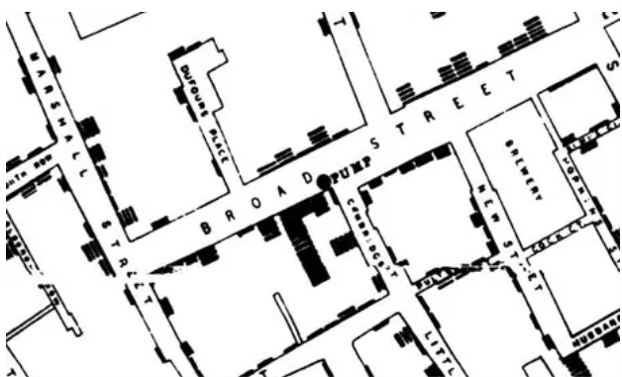

```{r setup, include=FALSE}
knitr::opts_chunk$set(echo = FALSE, message = FALSE, warning = FALSE, cache = FALSE, fig.retina = 3)
```

```{r Installing Loading Reqd Libraries, include=FALSE}

packages = c('DT','tidyverse', 'ggiraph', 'plotly', 'lubridate', 'naniar','stringr','dplyr','ggstance','ggpubr','hms','data.table','raster','sf','tmap','clock','rgdal','tibbletime','scales','knitr')

for(p in packages){
  if(!require(p, character.only = T)){
    install.packages(p)
  }
  library(p, character.only = T)
}
```


# 1 Background

Since 20 years ago, GASTech has been operating a natural gas production site in the island country of Kronos. The business has been profitable, and the company has also developed close relationships with the Kronos Government. In January 2014, following GASTech's initial public offering listing, several GASTech employees has gone missing. An organization known as Protectors of Kronos (POK) is suspected in these cases of missing persons, as GASTech's business moves had not been too environmentally friendly. A thorough investigation is to be carried out by the law enforcers of Kronos and Tethys to break this case.

Information and data pertaining to the whereabouts of company cars, purchases made by employees in local stores have been provided to the law enforcers. We shall use visual analytics to sense-make this data to facilitate the investigation. 

This would be done as a sub-component which would eventually feed into an interactive Shiny app for the use of the law enforcers, together with other sub-components covered by my project group mates. The objective of this assignment is to explore what the insights are and how they can be brought out from the depths of this dataset to aid in the investigation.

# 2 Literature Review

## 2.1 Crime Analysis - Overall

Crime analysis is a law enforcement function which involves systematic analysis for identifying and analyzing patterns and trends in crime and disorder [*Wikipedia*]. Too little data would inevitably limit the efficiency of the investigation, but overwhelming volume of information could pose a huge challenge as well. Coupled with the need for rapid analysis, too much information to absorb, categorize, remember and draw meaning from could compromise the overall investigation [*Data Mining and Predictive Analysis, Colleen McCue, 2007*]. Visual analytics techniques could be employed to gain useful insight from massive raw data.

For efficiency in data processing, information must first be consistent as subtle differences can greatly increase variability and reduce the reliability and value of a dataset [*Colleen McCue, 2007*]. Next, there cannot be information overload within a diagram. Good practices such as appropriate brushing and linking, selecting and marking, aggregation, elimination, virtual navigation techniques such as zooming, focus + context, and details-on-demand techniques have been studied and used to overcome an over-cluttered screen.[*Visual Analytics for Crime Analysis and Decision Support, Ku et. al, 2016*]. Uninteresting and expected patterns can also be unmarked to improve efficiency and reduce false positives. [*Arxiv, Visual of Anomalous User Behavior* ]

## 2.2 Approaches to Analyze Anomalous User Behaviors

According to [*Arxiv, Visual of Anomalous User Behavior*], detection of anomalous user behaviors can be a challenging task as the boundary between abnormal and normal data may not be clearly defined, and approaches like machine learning lack contextual information to support decision-making. Visualization techniques like sequence visualization, graph visualization, text visualization, geographic visualization, chart visualization can be combined with interaction methods like tracking and monitoring, pattern discovery, exploration and navigation to analyze anomalous user behaviors.

Analysis of anomalous travel behaviors can take the following approaches:

* Difference from expected patterns indicated by historic records
* Detection of irregular driving direction, hotspots
* Characteristic travel patterns associated with groups of travelers
* Statistical methods to identify outliers such as use of boxplots to look at deviation and its extent

Analysis of anomalous transactions can take the following approaches:

* To be used in conjunction with spatiotemporal data
* Probe into time series along with details on amounts transacted, no. of transactions within a period
* Identify activities that are new to the user

## 2.3 Visualizing Movement / Geospatial Map Types

According to Robert Krueger's dissertation on Visual Analytics of Human Mobility Behavior, movement data is more complex to handle than simple point-based data as it contains complex hierarchical structures of overlapping trajectories with diverse shapes and directions. 

1. Graphs (*R. Krueger, 2017*)

Movements can be spatially aggregated. A full spatial and temporal aggregation of the trajectories can result in a static graph G = (V,E) consisting of nodes V and edges E. Each edge e = (u,v) can encode directions and contain a weight that holds the travel volumes between the nodes. Analysis is flexible with this graph network and techniques such as clustering, segmentation, aggregation can be performed.  

2. Thematic Maps



This is the world famous cholera map produced by [Doctor John Snow](https://www.theguardian.com/news/datablog/2013/mar/15/john-snow-cholera-map) in 1854. Each bar plotted onto the map represents a death case. It was then immediately apparent where the deaths clustered, enabling investigation to be directed and focused. It eventually led them to the culprit water pump in Broad street which was polluted by sewage water tainted by a disposed baby nappy with cholera. Death statistics on their own might not have led to this discovery this soon had it not been geo-localized. This spatial autocorrelation is powerful.

3. Spatial-Temporal Perspectives: Multiple Coordinated Views (MCV)

Visualizations can include many types such as thematic maps, scatter plots, parallel coordinate plots, timelines and a wide range of other techniques. Interactivity to allow quick switching between these views can facilitate more insights. These systems are described generally as [coordinated-view visualizations](https://gistbok.ucgis.org/bok-topics/geovisual-analytics). An example is shown as below. Global population trends by country are compared using a parallel coordinate plot, choropleth map and treemap. (*Image courtesy of the National Center for Visual Analytics at Linkoping University*)


4. Spatial-Temporal Perspectives: 3D Coordinate System (Space-Time Cubes)

There can be perspective distortion and occlusion, but the spatio-temporal distribution can be highlighted. [*R. Krueger*]. [Space-time cubes](https://gisgeography.com/space-time-cubes/) show change over time within geographic space. Each cube represents a slice of time, in which the topmost cube has the newest timestamp. Temporal changes in that geographic area can then be visualized. Map below shows a space-time cube web scene in [ArcGIS Online (AGOL)](https://gisgeography.com/space-time-cubes/).


## 2.4 R Packages to Be Applied

1. DT - To make data tables interactive
2. plotly - For interactive charts
3. mapview, tmap, sf, raster - to handle geospatial data and movement visualization
4. lubridate, clock - to handle time and date values
5. scales - To handle label formatting in charts
6. naniar - For data exploration ; Check for missing values


# 3 Data Available

The following information is available.

1. Employee that the company car is assigned to : Last Name, First Name, CarID, Current Employment Type, Current Employment Title [_car-assignments.csv_]
2. GPS Tracking Info of Company Cars : Date, Time, Car ID, Latitude, Longitude [_gps.csv_]
3. Credit Card Transactions: Location, Date, Time, Price, Credit Card No. [_cc_data.csv_]
4. Loyalty Card: Location, Date, Price, Loyalty Card No. [_loyalty_data.csv_]
5. Employee Information: LastName, FirstName, Gender, CurrentEmployment Title [_EmployeeRecords.csv_]


# 4 Data Wrangling and Preparation

The type of data required would vary with the questions. This section would only cover the main data set up, EDA, quality of data, any general manipulations such as correcting the format of the data.

Special data manipulation specific to the questions would be covered in their respective sections instead.

We first load the datasets, via the read_csv() function.

```{r Loading the Datasets, echo=TRUE}

car_assigned <- read_csv("data/car-assignments.csv")
gpstracking <- read_csv("data/gps.csv")
loyaltycard <- read_csv("data/loyalty_data.csv")
creditcard <- read_csv("data/cc_data.csv")
emprecords <- read_csv("data/EmployeeRecords.csv")

```

To check for missing values, we use the _naniar_ package. The [naniar](https://naniar.njtierney.com/) package provides tidy ways to summarize, visualize and manipulate missing data.

```{r check missing values, echo=TRUE}

#For car_assigned
miss_var_summary(car_assigned)
#For creditcard
miss_var_summary(creditcard)
#For gpstracking
miss_var_summary(gpstracking)
#For loyaltycard
miss_var_summary(loyaltycard)

```

Here, we observe that the only dataset with missing values is _car_assigned_. From the filter below, we see that the truck drivers are not assigned cars. For now, other than to acknowledge this fact, we are indifferent to the missing values as there seems to be no other dataset which contains _LastName_ and _FirstName_ to be able to use the information below. Later, we would see that there is location tracking information on vehicles not within the cars list. These vehicles can be associated with any of the truck drivers below. 

For now, these rows can also be removed since we will be doing a join with the other datasets and would require a uniquely valid column without missing values. They will be removed via the _complete.cases()_ function.

```{r car_assigned missing values, echo=TRUE}

filtered_car <- car_assigned %>% 
  filter(is.na(CarID))

car_assigned_only <- car_assigned[complete.cases(car_assigned),]

```
Next, we shall ensure that the Timestamps are in the right and consistent format, using the _lubridate_ package. For the _loyaltycard_ dataset, the timestamp is only in _mdy_ format. We will observe that the timestamp will be converted to POSIXct (for creditcard and gpstracking dataset), and Date (for loyaltycard as there is only date data).

```{r formatting timestamp, echo=TRUE}

#For creditcard dataset
creditcard$TimeStampFormatted <-mdy_hm(creditcard$timestamp)

#Delete timestamp column
creditcard <- creditcard %>% 
  dplyr::select(-timestamp)

#Reorder columns
col_order <- c("TimeStampFormatted", "location","price","last4ccnum")
creditcard <- creditcard[, col_order]

#For gpstracking dataset
gpstracking$TimeStampFormatted <-mdy_hms(gpstracking$Timestamp)
gpstracking$hour <- hour(gpstracking$TimeStampFormatted)

#Delete timestamp column
gpstracking <- gpstracking %>% 
  dplyr::select(-Timestamp)

#Reorder columns
col_order <- c("TimeStampFormatted", "id","lat","long","hour")
gpstracking <- gpstracking[, col_order]

#For loyaltycard dataset
loyaltycard$TimeStampFormatted <- mdy(loyaltycard$timestamp)

#Delete timestamp column
loyaltycard <- loyaltycard %>% 
  dplyr::select(-timestamp)

#Reorder columns
col_order <- c("TimeStampFormatted", "location","price","loyaltynum")
loyaltycard <- loyaltycard[, col_order]

```

We also observe special unidentifiable characters in _Katerina's Cafe_ in the _creditcard_ and _loyaltycard_ dataset. Those shall be identified and replaced using the str_replace_all() function to prevent error in data processing.

```{r special char in katerinas cafe, echo=TRUE}

#creditcard

creditcard <- creditcard %>% 
  mutate(location = str_replace_all(location,pattern = "Katerin.+",replacement = "Katerinas Cafe"))%>%   mutate(location = str_replace_all(location,pattern = "[^[:alnum:]]",replacement = " "))

#loyaltycard

loyaltycard <- loyaltycard %>% 
  mutate(location = str_replace_all(location,pattern = "Katerin.+",replacement = "Katerinas Cafe"))%>%   mutate(location = str_replace_all(location,pattern = "[^[:alnum:]]",replacement = " "))


```

Next, we include into the _gpstracking_ dataset, the first and last names of the personnel the car is assigned to. We essentially want to do a left join for the _gpstracking_ dataset, and the _car_assigned_ dataset, by the car ID. We can do this with the left_join() function, so that we keep all rows in the _gpstracking_ dataset.

```{r Joining gpstracking and car_assigned}

gpsname <- left_join(gpstracking, car_assigned_only, by = c("id" = "CarID"))

#Join First Name and Last Name

gpsname$name <- paste(gpsname$FirstName, gpsname$LastName)

#Reorder cols
col_order <- c("TimeStampFormatted", "id","lat","long","hour","name","LastName","FirstName","CurrentEmploymentType","CurrentEmploymentTitle")
gpsname <- gpsname[, col_order]

```

Next, we shall prepare the geospatial map for viewing. We would use the _Raster_ package to import the raster file for the map of Abila.

The file to be imported is already georeferenced using qGIS, into .tif format.
Note that the raster layer is a three bands false colour image, we would use tm_rgb() instead of tm_raster() to be able to display all three bands. If not, the layer would come out in monochrome.

```{r Geomap, echo=TRUE}

#Importing the Raster file

bgmap <- raster("data/MC2/MC2-tourist_modified.tif")

#Plotting the Raster Layer and defining as base layer.

tmap_mode("view")

tmain <- tm_shape(bgmap) +
  tm_rgb(bgmap, r = 1, g = 2, b = 3,
            alpha = NA,
         saturation = 1,
         interpolate = TRUE,
         max.value = 255)

```

Then, we shall map the aspatial data next. Essentially, the following general steps are required to be able to create layers to visualize on the map:

1. Select the latitude and longitude coordinates that we want displayed. These coordinates are in the _.dbl_ format.

2. Convert it to Simple Feature Data Frame via the _st_as_sf()_ function of the _sf_ package; Coordinates would be converted to geometry format. They would be input as longitude ('long' ; x-coordinates) and latitude ('lat' ; y-coordinates), in the EPSG: 4326 format, which is the wgs84 Geographic Coordinate System.

Example:

```{r Conversion into Simple Feature Data Frame, eval=FALSE, include=TRUE}

gps_sf <- st_as_sf(gpstracking,
                   coords = c("long", "lat"),
                   crs = 4326)
```

3. We can either use them as individual geometry points, or string them up to form a path

4. To form a path, we use the _st_cast("LINESTRING")_ function

Example:

_(Here, we are creating the movement path from GPS points for each car. Hence, we need to group the data by the car ID, the identifier. As R requires a command following the group_by() function, an input will be required for the code to run, so we include a dummy summarize() code to overcome this issue.)_

```{r Creating Movement Path, eval=FALSE, include=TRUE}

gps_path <- gps_sf %>% 
  group_by(id) %>% 
  summarize(m = mean(TimeStampFormatted),
            do_union = FALSE) %>% 
  st_cast("LINESTRING")

```

We would like to find out where the vehicles have gone to.
First, we have to identify the coordinate points where the vehicles have possibly made stops, and be able to visualize where these stops are on the map. We could decipher this information from the _gpstracking_ data, which tracks the coordinate points of vehicles as long as they are moving. This means that when there is a long gap in the timestamp at a particular coordinate point, it is likely that the vehicle has parked. Stops at traffic light junctions should take no longer than 2 minutes. As such, we shall assume for vehicles which are stationary for more than 4 minutes to be parked (i.e. search for timestamps with lag of more than 4 minutes). 

In addition, we note that for position coordinates, the number of decimal places required for a particular accuracy at the equator is:

{width=35%}

Considering the sizes of typical carparks, the accuracy of 1.11m would be too precise. A more likely range could be 11.1m. With this, we shall round all our coordinate points up to 4 decimal points for analysis.

A map with all stops identified from the entire _gpstracking_ dataset is as shown.

```{r interactive map viewing of the points, echo=TRUE}

#Round lat long points to 4 decimal points

gpstracking$lat <- round(gpstracking$lat, 4)
gpstracking$long <- round(gpstracking$long, 4)

#Identifying all stops for all Car IDs and Time

tmap_mode("view")

all_stops <- gpstracking %>%
  group_by(id) %>%
  mutate(stop = TimeStampFormatted - lag(TimeStampFormatted)) %>%
  mutate(parked = ifelse(stop >60*4, TRUE,FALSE)) %>%
  ungroup() %>%
  filter(parked == TRUE) %>%
  distinct(lat, long)

#Converting it to sf

all_stops_sf <- st_as_sf(all_stops,
                         coords = c("long", "lat"),
                         crs = 4326) %>% 
  mutate(coordinates = geometry)

#Viewing it on the map

tm_all_stops <- tmain +
  tm_shape(all_stops_sf) +
  tm_dots(size = 0.1,
          alpha = 0.3,
          col = "red")

tm_all_stops

```

We can observe that there is clustering effect of points, indicating that our rounding of the coordinate points is sufficient to remove variation noise, yet maintain the distinction between different spatial points, as there continues to be points scattered around the map.

With all of the above codes, the following function *print_routes_ID_date(emp_id, start_dt,end_dt)* is created to generate the routes of a specific vehicle, during a specific time period. This way, we are able to print the routes for a specific vehicle ID, for a selected time period from *start_dt* to *end_dt*. 

```{r function for printing vehicle routes by ID and datetime, echo=TRUE}

print_routes_ID_date <- function(emp_id,start_dt,end_dt){
  
  #filter gps_path by ID and datetime
  
  #Start with gpstracking, filter
  
  id_time_select <- gpstracking %>% as_tbl_time(index=TimeStampFormatted) %>%
  filter(id == emp_id) %>% 
  filter_time(start_dt ~ end_dt)
  
  #Convert to selected sf
  
  gps_sf_selected <- st_as_sf(id_time_select,
                         coords = c("long", "lat"),
                         crs = 4326) %>% 
    mutate(coordinates = geometry)
  
  #Create a LineString
  
    gps_path_selected <- gps_sf_selected %>% 
  group_by(id) %>% 
  summarize(m = mean(TimeStampFormatted),
            do_union = FALSE) %>% 
  st_cast("LINESTRING")
  
    #filter stop points by ID and datetime
  
  stops <- gpstracking %>% as_tbl_time(index=TimeStampFormatted) %>%
  group_by(id) %>%
  filter(id == emp_id) %>% 
  filter_time(start_dt ~ end_dt) %>% 
  mutate(stop = TimeStampFormatted - lag(TimeStampFormatted)) %>%
  mutate(parked = ifelse(stop >60*4, TRUE,FALSE)) %>%
  ungroup() %>%
  filter(parked == TRUE) %>%
  distinct(lat, long)
    
  #Converting stop points to sf
  
  stops_sf <- st_as_sf(stops,
                         coords = c("long", "lat"),
                         crs = 4326) 
  
  #Viewing it on the map
  
  mapviz <- tm_all_stops +
    tm_shape(gps_path_selected) +
    tm_lines(lwd = 3) +
    tm_shape(stops_sf) +
    tm_dots(size = 0.1,
            alpha = 0.3,
            col = "green")
  
  return(mapviz)
  
}

```

Example of printing the route for car ID #31, on a specific date time period - 18 Jan.

```{r trying out the print_route function, echo=TRUE}

print_routes_ID_date(31,'2014-01-18 00:00:00','2014-01-18 23:59:00')

```
